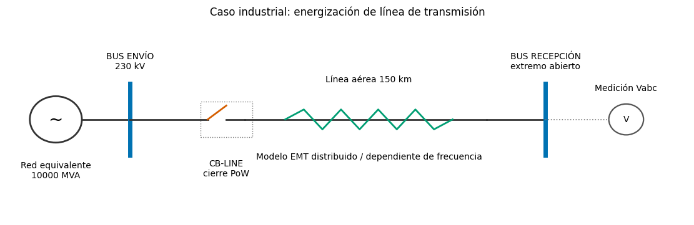

# Industrial EMT Studies with DIgSILENT PowerFactory and Python

[](https://www.python.org/)
[](https://www.digsilent.de/)
[](LICENSE)

Repositorio reproducible para construir, ejecutar y documentar estudios de
transitorios electromagnéticos (EMT) en DIgSILENT PowerFactory mediante Python.
La intención es tratar cada estudio como un producto de ingeniería: parámetros
versionados, escenarios repetibles, validaciones explícitas, resultados
tabulares, figuras publicables y trazabilidad.

> **Estado:** la infraestructura común y el primer caso vertical
> (energización de una línea aérea de 230 kV) están implementados. Los demás
> casos están especificados en el [roadmap](docs/roadmap.md) y se incorporarán
> incrementalmente con la misma estructura.

## Primer caso: energización de línea

El estudio crea completamente por API una red equivalente de 230 kV, un
interruptor, una línea distribuida dependiente de frecuencia de 150 km y un
extremo abierto. Ejecuta un barrido de 12 puntos sobre onda, exporta las señales
instantáneas a CSV y calcula el peor pico fase-tierra en pu.



```text
Red Thevenin ── BUS ENVÍO ── CB ── Línea EMT 150 km ── BUS RECEPCIÓN (abierto)
```

La base de tensión del KPI es:

```text
Vbase,pico,fase-tierra = Vnominal,LL,RMS × sqrt(2/3)
```

### Resultado reproducido en PowerFactory 2024 SP2

La ejecución licenciada del 2026-07-28 completó los 12 escenarios. El peor pico
fue **2.2570 pu / 423.85 kV fase-tierra** en 30°, 90°, 150°, 210°, 270° y 330°.
La máxima corriente de cierre fue **0.8656 kA pico** en el grupo complementario.


La línea base y sus tolerancias están versionadas en
[`studies/01_line_energization/expected/powerfactory_2024_sp2.yaml`](studies/01_line_energization/expected/powerfactory_2024_sp2.yaml).
Estos valores validan el flujo de software del ejemplo; no constituyen por sí
solos un criterio de coordinación de aislamiento.

Los parámetros son deliberadamente visibles y están marcados como ejemplo. Un
entregable real debe usar la geometría validada de torre/conductores, resistividad
del terreno, tolerancias y datos estadísticos del interruptor.

## Estructura

```text
.
├── config/                         # perfiles de conexión, sin secretos
├── docs/                           # arquitectura, referencias y roadmap
├── src/pfemt/                      # librería reutilizable
│   ├── builders/                   # construcción de modelos por API
│   ├── application.py              # descubrimiento/conexión PowerFactory
│   ├── simulation.py               # ComInc y ComSim
│   ├── results.py                  # ElmRes y ComRes
│   ├── scenarios.py                # punto sobre onda y Monte Carlo
│   ├── metrics.py                  # KPI eléctricos
│   ├── plotting.py                 # figuras reproducibles
│   └── workflows.py                # orquestación extremo a extremo
├── studies/
│   └── 01_line_energization/
│       ├── configs/base.yaml
│       ├── parameters/
│       ├── scripts/
│       └── outputs/                # generado, excluido de Git
└── tests/
```

La librería propietaria `powerfactory.pyd`, proyectos `.pfd` y resultados
generados no se incluyen en el repositorio.

## Requisitos

- DIgSILENT PowerFactory 2024 SP2 o compatible.
- Licencia con el módulo EMT habilitado.
- Python compatible con la carpeta `PowerFactory <versión>/Python/<versión>`.
- Para esta estación de trabajo se detectó Python 3.9 y PowerFactory 2024 SP2.

## Instalación

En PowerShell:

```powershell
cd powerfactory-emt-industrial-studies
py -3.9 -m venv .venv
.\.venv\Scripts\Activate.ps1
python -m pip install --upgrade pip
python -m pip install -e ".[dev]"
pfemt doctor
pfemt validate studies/01_line_energization/configs/base.yaml
```

`pfemt doctor` sólo inspecciona instalaciones y no consume una licencia.

## Dos modos de ejecución

### 1. Dentro de PowerFactory — recomendado para la primera ejecución

1. Abra PowerFactory con el usuario/licencia habituales.
2. Cree un objeto **Python Script (ComPython)**.
3. Seleccione como archivo externo:
   `studies/01_line_energization/scripts/build_model_inside_powerfactory.py`.
4. Ejecútelo una vez para crear el proyecto y el Study Case.
5. Seleccione y ejecute
   `studies/01_line_energization/scripts/run_sweep_inside_powerfactory.py`.

Este camino utiliza `powerfactory.GetApplication()` y evita problemas de
credenciales del modo engine.

### 2. Desde una terminal — engine mode

El YAML base usa `GetApplicationExt()`. Si el usuario de PowerFactory no coincide
con el usuario de Windows, defínalo sin escribir credenciales en Git:

```powershell
$env:PFEMT_USERNAME = "usuario_powerfactory"
$env:PFEMT_PASSWORD = "secreto_temporal"
pfemt build studies/01_line_energization/configs/base.yaml
pfemt sweep studies/01_line_energization/configs/base.yaml
```

Para forzar ejecución interna se admite
`PFEMT_CONNECTION_MODE=internal`. Nunca guarde contraseñas en el YAML.

## Posprocesamiento sin licencia

Una vez exportados los CSV:

```powershell
pfemt analyse studies/01_line_energization/configs/base.yaml
```

Se generan:

- CSV normalizados y manifiesto de escenarios;
- JSON de métricas por caso;
- formas de onda `Vabc`/`Iabc`;
- resumen de sobretensión frente al ángulo de cierre;
- diagrama unifilar;
- reporte Markdown por escenario.

También pueden generarse el diagrama y el manifiesto antes de simular:

```powershell
pfemt diagram studies/01_line_energization/configs/base.yaml
pfemt manifest studies/01_line_energization/configs/base.yaml
```

## Criterios de calidad

- Ningún error de PowerFactory se ignora: los códigos distintos de cero detienen
  el flujo.
- Los escenarios deterministas y Monte Carlo registran su semilla y parámetros.
- Los resultados de prueba son sintéticos y se usan sólo para probar el
  posprocesamiento; nunca se presentan como salidas de PowerFactory.
- El estudio exige sensibilidad al paso temporal antes de aceptar el máximo.
- Cada magnitud lleva unidad y la base pu está documentada.
- Los artefactos regenerables quedan fuera de Git.

## Alcance de ingeniería

Este software es una plantilla de investigación e ingeniería. No reemplaza la
revisión del modelo, la coordinación de aislamiento, la especificación del
fabricante ni los procedimientos de la empresa eléctrica. Antes de emitir un
informe de diseño deben validarse datos, modelos, paso temporal, condiciones
iniciales y criterios normativos.

## Licencia y cita

Código disponible bajo licencia [MIT](LICENSE). Los metadatos de cita están en
[CITATION.cff](CITATION.cff). PowerFactory y sus componentes pertenecen a
DIgSILENT GmbH y requieren su propia licencia.
