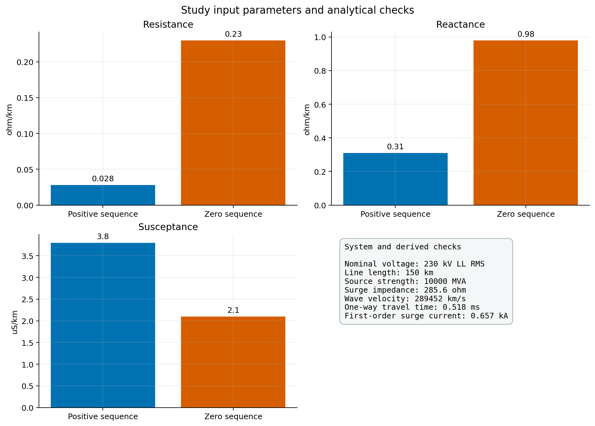
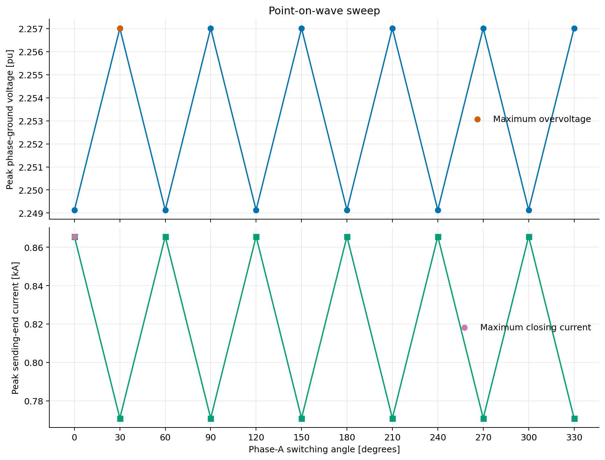
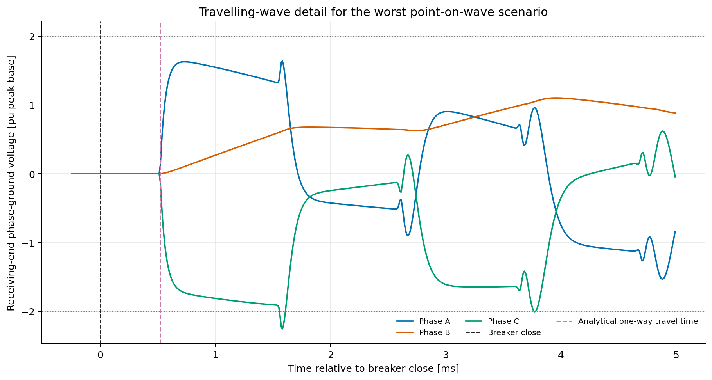
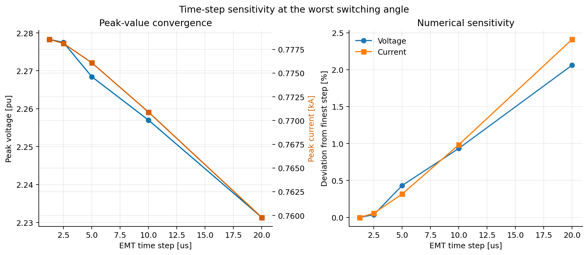
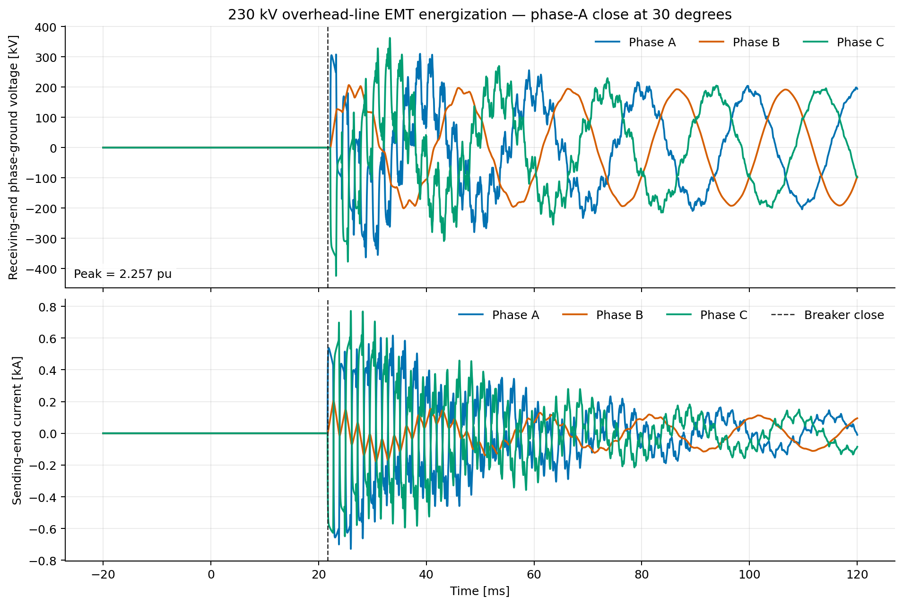
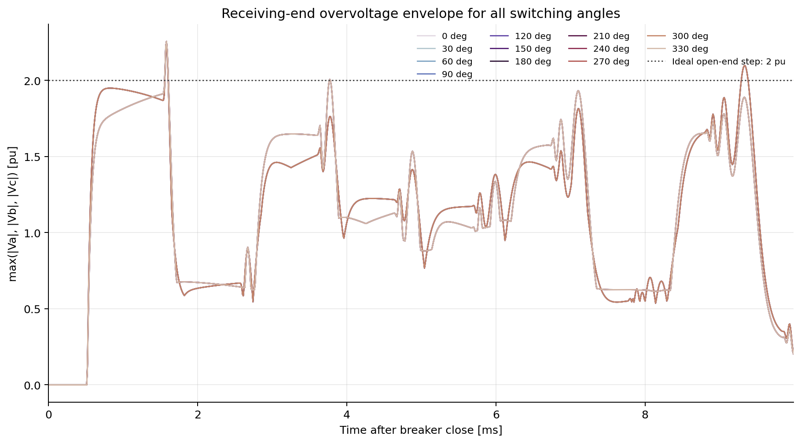

# Study 01 — 230 kV Overhead-Line Energization

## 1. Purpose

Quantify the open-end transient overvoltage of a 150 km overhead line and find
the most severe breaker-closing point on wave. The case demonstrates the
workflow commonly used before controlled-switching, insulation-coordination,
shunt-reactor, and surge-arrester decisions.

## 2. Study question and decision metric

**Question:** How does the phase-A breaker-closing angle affect the maximum
instantaneous phase-ground voltage at the open receiving end?

**Primary KPI:**

```text
max(|Va|, |Vb|, |Vc|) / [VLL,RMS * sqrt(2/3)]
```

**Secondary KPI:** maximum absolute sending-end phase current after closing.

The example result is used to verify the automation and demonstrate the method.
It is not an equipment withstand or arrester-selection limit.

## 3. Model topology

```text
Thevenin grid -> sending bus -> three-pole breaker -> line-side bus
              -> 150 km distributed EMT line -> open receiving bus
```

The model builder creates both the electrical network and its native
PowerFactory graphical objects. The linked `IntGrfnet` is exported from the
interactive Graphics Board with
[`scripts/export_diagram_inside_powerfactory.py`](scripts/export_diagram_inside_powerfactory.py);
no presentation-only one-line is generated outside PowerFactory.

| Function | Object | Stable name |
|---|---|---|
| Grid equivalent | `ElmXnet` | `GRID_EQUIVALENT` |
| Sending bus | `ElmTerm` | `BUS_SENDING_230` |
| Breaker | `ElmCoup` | `CB_LINE_230` |
| Breaker line-side bus | `ElmTerm` | `BUS_LINE_SIDE_230` |
| Overhead line | `ElmLne` | `LINE_230KV_150KM` |
| Receiving bus | `ElmTerm` | `BUS_RECEIVING_230` |
| Native diagram | `IntGrfnet` | `EMT Line Energization 230 kV` |

## 4. Input basis

The executable source of truth is [`configs/base.yaml`](configs/base.yaml). The
reviewable parameter classification is
[`parameters/parameter_basis.csv`](parameters/parameter_basis.csv).

### 4.1 Source

- 230 kV line-line RMS, 50 Hz.
- Thevenin short-circuit power: 10,000 MVA.
- Positive-sequence R/X: 0.10.
- Zero-sequence X0/X1: 1.0 and R0/X0: 0.10.

### 4.2 Line

- Length: 150 km.
- Rated current: 1.20 kA.
- Distributed representation: `ElmLne.i_dist = 1`.
- Frequency-dependent fit: `ElmLne.i_model = 1`.
- Fitting range: 10 Hz to 10 kHz.
- Main transient frequency: 1 kHz.
- Sequence parameters are transparent example values, not a replacement for
  tower, conductor, earth-wire, transposition, and soil-resistivity geometry.



### 4.3 EMT simulation

- Start time: -20 ms.
- Stop time: 120 ms.
- Base-case time/output step: 10 us.
- Domain: instantaneous EMT.
- Closing cases: 0 to 330 degrees, every 30 degrees.

## 5. Detailed procedure

### Step 1 — Validate configuration

Run `pfemt validate configs/base.yaml`. This checks the required sections,
simulation duration, and time-step bounds before PowerFactory is accessed.

### Step 2 — Create or update the project

The builder:

1. creates or activates `PFEMT_01_Line_Energization_230kV`;
2. creates `GRID_230KV` and all six electrical elements;
3. creates the cubicles and assigns terminal pointers;
4. creates the `TypLne` sequence-parameter line type;
5. creates the Study Case and calculation commands;
6. generates a native diagram with the Diagram Layout Tool;
7. applies deterministic horizontal coordinates to the linked `IntGrf` objects.

The operation is idempotent: rerunning the builder updates the named objects
instead of creating a second electrical model.

### Step 3 — Prepare the distributed line

The builder calls:

```python
line.AreDistParamsPossible()
line.FitParams(0, 1)
```

Both return codes must be zero. A non-zero value stops the workflow rather than
silently reverting to an unsuitable representation.

### Step 4 — Configure initial conditions and simulation

`ComInc` is connected to the event folder and result file. `ComSim` receives the
EMT stop time, integration step, and output step from YAML.

### Step 5 — Generate the point-on-wave manifest

For each angle, the event time is:

```text
tclose = tbase + angle / (360 * frequency)
```

This converts a phase-A electrical angle into an absolute deterministic event
time. The complete manifest is written before the first simulation.

### Step 6 — Apply the breaker event

The workflow resets the breaker to open and creates one `EvtSwitch` close action
on `CB_LINE_230`. The event targets all three poles.

### Step 7 — Register instantaneous channels

The result contract is:

| Stable column | PowerFactory variable | Unit |
|---|---|---|
| `v_recv_a_kv` | `BUS_RECEIVING_230:m:U:A` | kV |
| `v_recv_b_kv` | `BUS_RECEIVING_230:m:U:B` | kV |
| `v_recv_c_kv` | `BUS_RECEIVING_230:m:U:C` | kV |
| `i_send_a_ka` | `LINE_230KV_150KM:m:I:bus1:A` | kA |
| `i_send_b_ka` | `LINE_230KV_150KM:m:I:bus1:B` | kA |
| `i_send_c_ka` | `LINE_230KV_150KM:m:I:bus1:C` | kA |

The uppercase `U` and `I` identifiers are intentional because this result
contract uses engineering units.

### Step 8 — Run and export

For every case the workflow executes `ComInc`, `ComSim`, and `ComRes`. Raw CSV
files remain unchanged. pandas maps PowerFactory headers to the stable schema.

### Step 9 — Calculate metrics and rank cases

Pre-event samples are excluded from peak selection. Each case records signed
and absolute peak, phase, time, angle, source voltage, and line length.



### Step 10 — Compare with independent physical checks

From the positive-sequence line inputs:

```text
L1 = X1 / (2*pi*f)
C1 = B1 / (2*pi*f)
Zc = sqrt(L1/C1)
v  = 1/sqrt(L1*C1)
tw = line_length/v
```

The example gives approximately:

- surge impedance: 286 ohm;
- propagation velocity: 289,000 km/s;
- one-way travel time: 0.519 ms;
- first-order surge-current estimate: 0.658 kA;
- ideal lossless open-end step: 2.0 pu.

These are order-of-magnitude checks. The EMT response also contains the source
impedance, phase coupling, losses, frequency dependence, and reflections.



### Step 11 — Compare the regression reference

`analyse_sweep()` compares maximum voltage/current with
[`expected/powerfactory_2024_sp2.yaml`](expected/powerfactory_2024_sp2.yaml).
The workflow writes `validation/baseline_comparison.json` and fails when a
metric exceeds its declared relative tolerance.

### Step 12 — Run time-step sensitivity

The worst 30-degree case is repeated at 20, 10, 5, 2.5, and 1.25 us. The figure reports
both the peak values and their deviations from the finest step.

| Time step | Peak voltage | Peak current | Voltage deviation from 1.25 us |
|---:|---:|---:|---:|
| 20 us | 2.231336 pu | 0.759790 kA | 2.062% |
| 10 us | 2.257010 pu | 0.770900 kA | 0.935% |
| 5 us | 2.268451 pu | 0.776097 kA | 0.433% |
| 2.5 us | 2.277485 pu | 0.778130 kA | 0.036% |
| 1.25 us | 2.278305 pu | 0.778563 kA | reference |

The 2.5-to-1.25 us comparison is below 0.1% for both reported peaks. The 10 us
case remains the regression baseline for the original 12-angle sweep, but it
must not be described as the converged design peak.



## 6. Verified base-case result

- Maximum voltage: **2.257009877 pu / 423.853395 kV phase-ground peak**.
- Maximum-voltage angles: **30, 90, 150, 210, 270, and 330 degrees**.
- Maximum closing current: **0.865571 kA peak**.
- Maximum-current angles: **0, 60, 120, 180, 240, and 300 degrees**.

These values belong to the 10 us 12-angle baseline. The finer time-step result
for the 30-degree case is documented separately above.





## 7. Execution

### Inside PowerFactory

Create `ComPython` objects that reference, in order:

1. `scripts/build_model_inside_powerfactory.py`
2. `scripts/export_diagram_inside_powerfactory.py`
3. `scripts/run_sweep_inside_powerfactory.py`
4. `scripts/run_timestep_sensitivity_inside_powerfactory.py`

Then run the pandas stage:

```powershell
python scripts/analyse_results.py
```

### From a terminal

```powershell
pfemt build configs/base.yaml
pfemt sweep configs/base.yaml
pfemt sensitivity configs/base.yaml
pfemt analyse configs/base.yaml
```

The diagram export is intentionally performed inside the interactive
PowerFactory application because it requires an active Graphics Board.

## 8. Acceptance checklist for adapting the example

1. Replace example sequence data with validated project geometry and materials.
2. Verify positive-, negative-, and zero-sequence inputs.
3. Confirm the breaker event action, phases, closing statistics, and pole scatter.
4. Review source impedance and operating voltage ranges.
5. Include trapped charge, shunt reactors, arresters, and equipment as required.
6. Confirm the monitored variable identifiers and units in the installed version.
7. Run a time-step convergence study for the final model.
8. Compare frequency-sweep and EMT/FFT line responses when model fidelity matters.
9. Compare stresses with the applicable insulation-coordination criteria.
10. Have the final assumptions, scenarios, and results independently reviewed.
