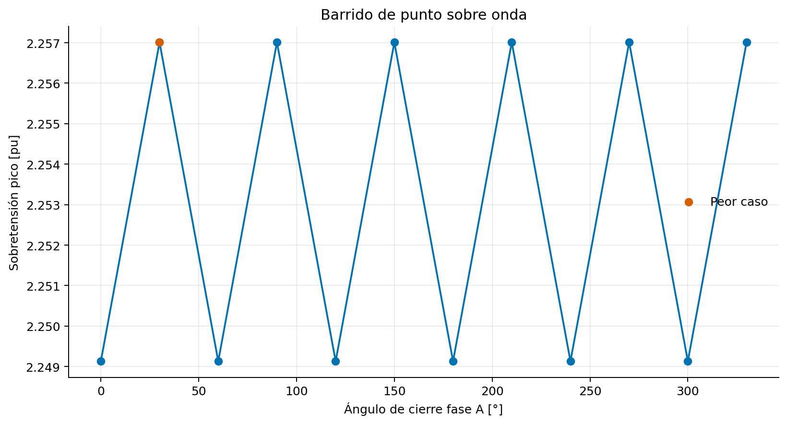

# 01 — Energización de línea de 230 kV

## Objetivo

Cuantificar la sobretensión transitoria en el extremo abierto de una línea aérea
de 150 km y localizar el peor punto sobre onda de cierre. El caso reproduce un
flujo habitual de especificación de interruptores, coordinación de aislamiento y
evaluación preliminar de reactores/descargadores.

## Topología

`Red equivalente → barra de envío → interruptor → línea distribuida → extremo abierto`

El constructor Python crea el proyecto, la red, los cubículos, el tipo de línea,
el Study Case, `ComInc`, `ComSim`, `ElmRes`, `IntEvt` y `ComRes`. No se necesita
crear manualmente el circuito.

## Casos

- 12 cierres entre 0° y 330° con separación de 30°.
- Paso EMT y de salida de 10 μs.
- Registro de `Vabc` en recepción e `Iabc` en envío.
- Exportación de cada caso a CSV.
- KPI: máximo `|Vfase-tierra|` expresado sobre la base pico nominal
  `VLL,rms·sqrt(2/3)`.

## Ejecución

Desde PowerFactory, cree un objeto **ComPython**, seleccione como script externo
`scripts/build_model_inside_powerfactory.py` y ejecútelo una vez. Después use
`scripts/run_sweep_inside_powerfactory.py`.

El posprocesamiento no consume licencia:

```powershell
python scripts/analyse_results.py
```

Los artefactos se generan bajo `outputs/` y no se versionan, salvo los archivos
de control vacíos.

## Línea base verificada

PowerFactory 2024 SP2 ejecutó los 12 casos con licencia EMT:

- Peor tensión: 2.257009877 pu / 423.853395 kV pico fase-tierra.
- Ángulos del peor grupo: 30°, 90°, 150°, 210°, 270° y 330°.
- Máxima corriente de cierre: 0.865571 kA pico.



El archivo `expected/powerfactory_2024_sp2.yaml` contiene hashes, tolerancias y
metadatos para detectar cambios involuntarios.

## Controles antes de aceptar resultados

1. Verificar que la licencia incluye EMT.
2. Confirmar `AreDistParamsPossible() == 0` y `FitParams() == 0`.
3. Revisar en PowerFactory que el evento sea **close** sobre las tres fases.
4. Ejecutar sensibilidad al paso temporal.
5. Sustituir parámetros de ejemplo por datos del proyecto real.
6. Comparar energía y tensión con una formulación independiente o caso de
   referencia.
