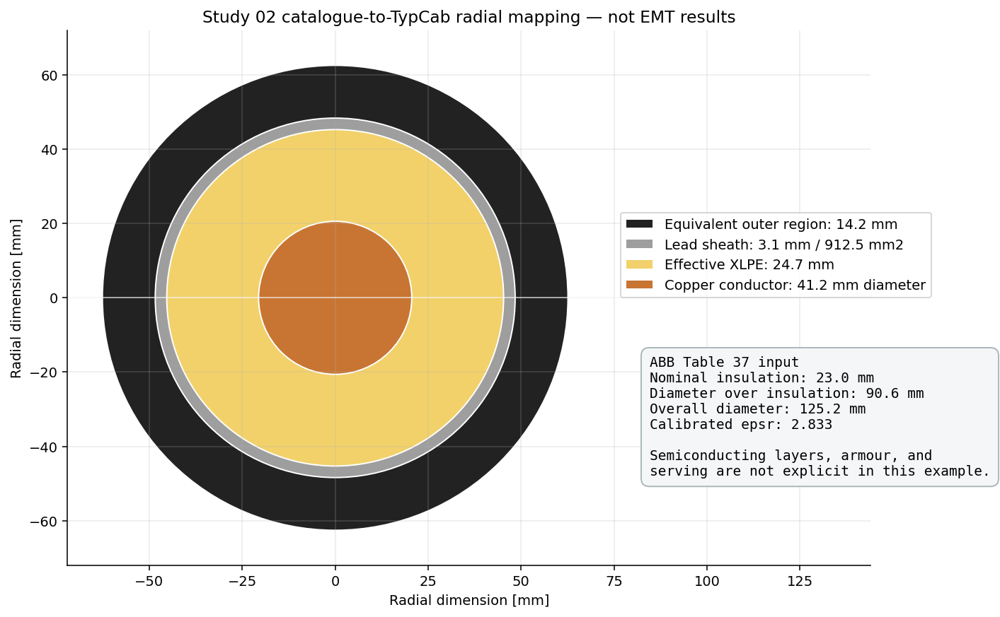
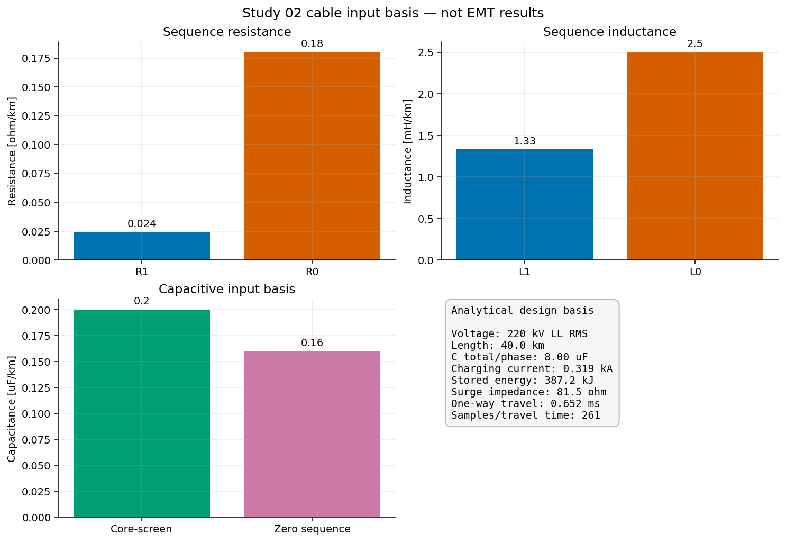
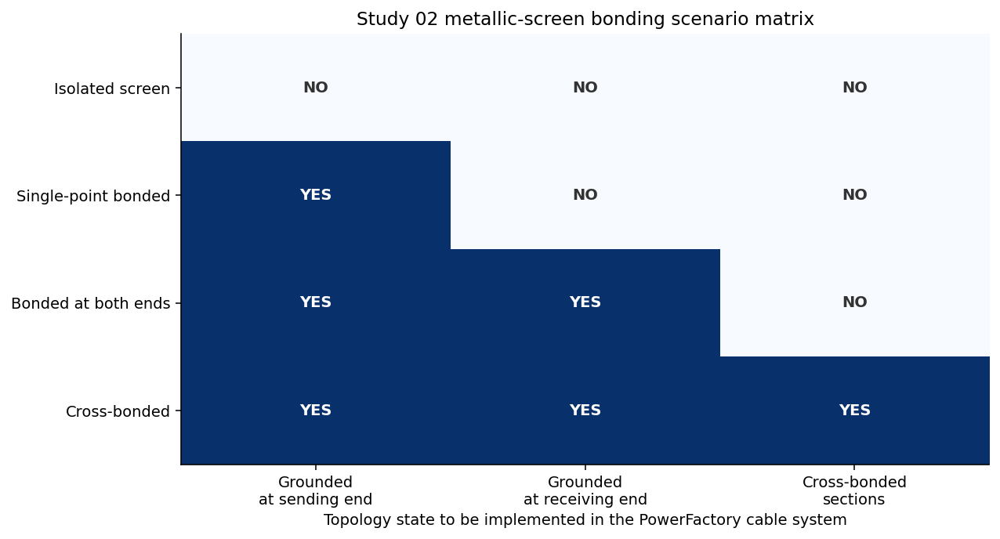
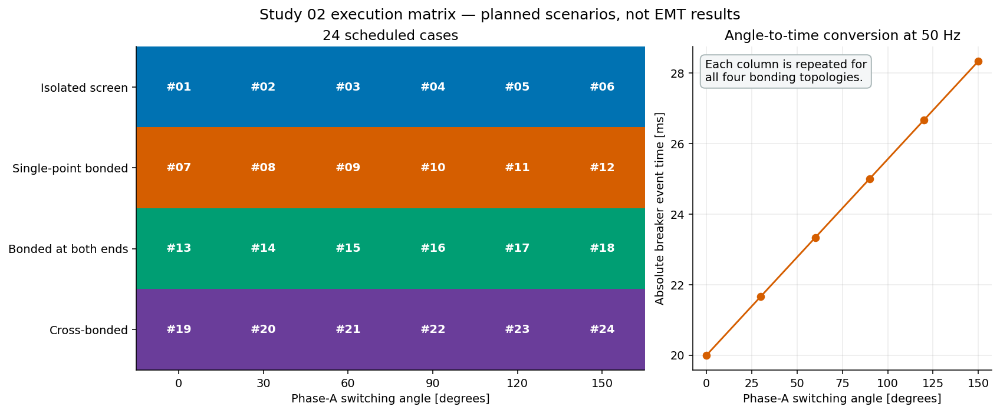
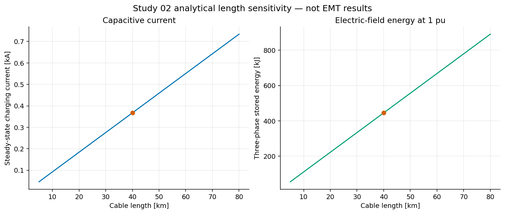
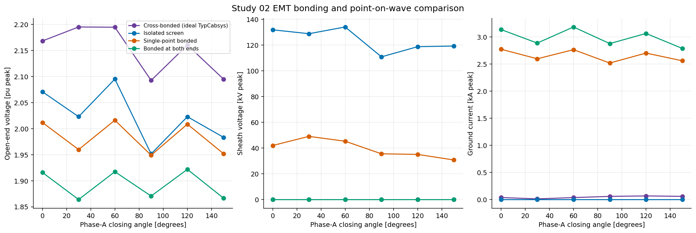
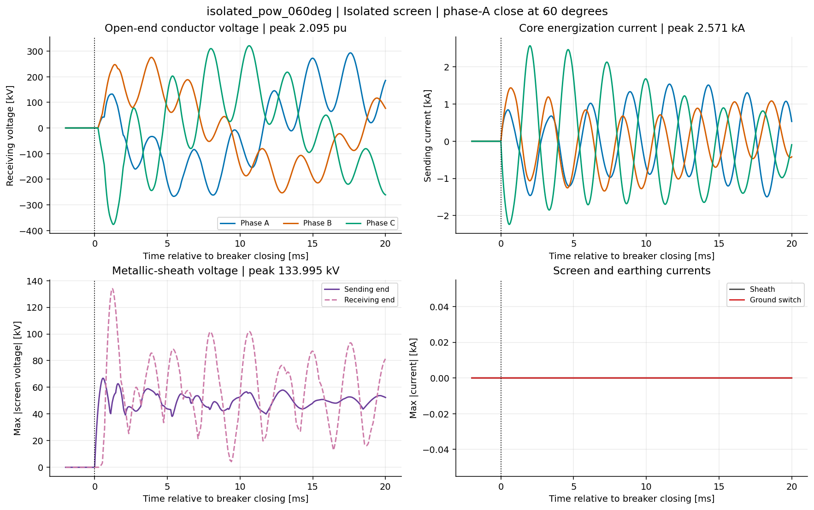
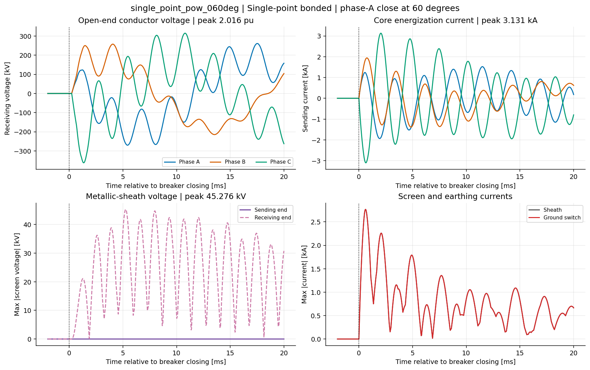
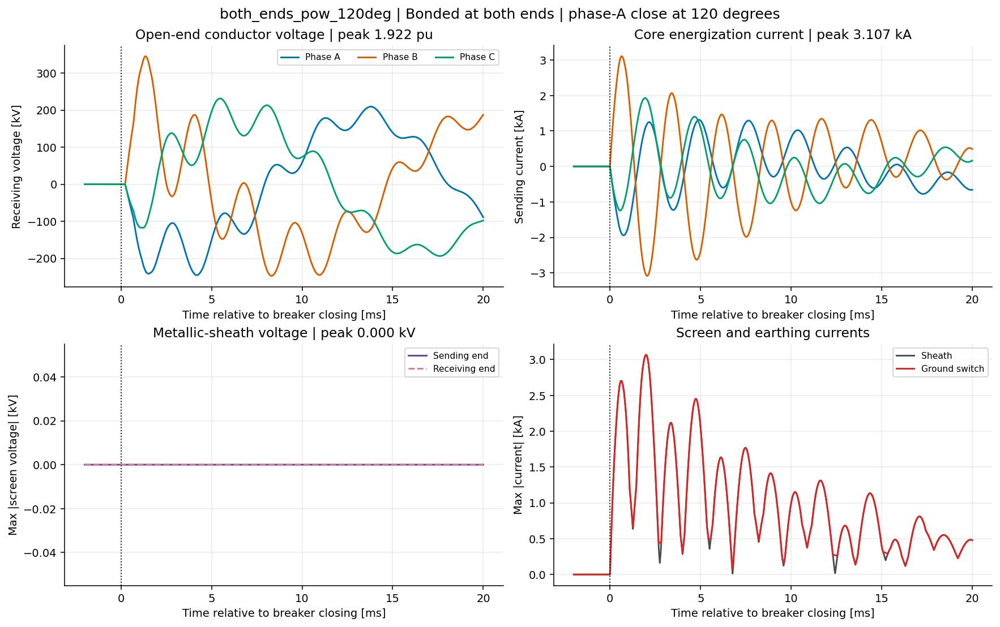
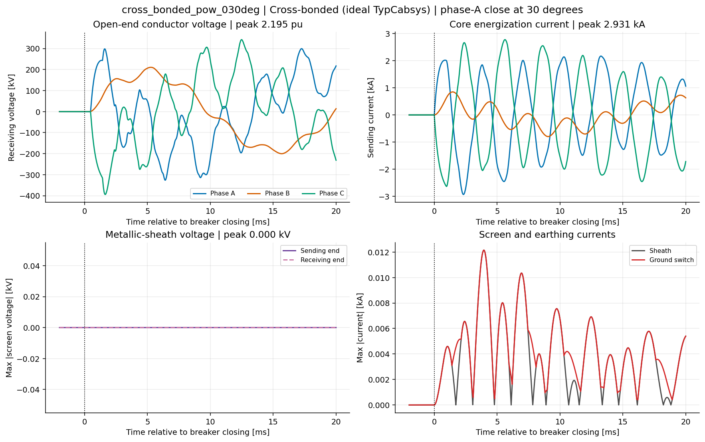

# Study 02 — 220 kV XLPE Cable Energization and Sheath Bonding

> **Status: reproducible PowerFactory EMT baseline complete; native-diagram visual polish pending.** The
> catalogue-derived `TypCab`, geometric `TypCabsys`, explicit core/sheath
> `ElmLne` pair, `ElmCabsys` coupling, native-diagram layout, 24-case manifest,
> analytical checks, and tests are implemented. PowerFactory 2024.0.2 engine
> integration, API read-back, all 24 EMT runs, CSV processing, metrics, and
> curated waveform figures pass. The native PowerFactory diagram remains the
> final collaborative drawing task.

## 1. Industrial question

How do breaker point on wave and metallic-screen bonding affect the transient
core voltage, screen voltage, conductor current, screen current, and energy
duty when a long 220 kV XLPE cable is energized with its receiving end open?

This question is relevant to cable sealing ends, link boxes, sheath-voltage
limiters, grounding conductors, arresters, shunt reactors, controlled switching,
and commissioning procedures.

## 2. Decisions and acceptance metrics

The completed EMT study will rank each switching/bonding scenario using:

1. maximum core-to-screen and core-to-ground voltage at both cable ends;
2. maximum metallic-screen voltage to ground at joints and terminations;
3. peak and RMS conductor current;
4. peak and RMS screen/earth-continuity-conductor current;
5. dominant transient frequency and damping;
6. one-way wave-arrival time and reflection sequence;
7. arrester or sheath-voltage-limiter energy, when those devices are added;
8. time-step and model-bandwidth sensitivity.

Equipment limits are intentionally absent from this example. They must come
from project specifications and manufacturer data.

## 3. Target PowerFactory model

```text
Thevenin source -> sending bus -> three-pole breaker -> core ElmLne circuit
                -> open receiving bus

ground switch -> sending screen terminal -> screen ElmLne circuit
                                      -> receiving screen terminal -> ground switch
                    ^ core and screen circuits coupled by ElmCabsys
```

PowerFactory represents the explicit-sheath example as core and screen line
circuits coupled by `ElmCabsys`; the coupling receives the geometric
`TypCabsys`, which in turn references the single-core `TypCab` definition.

The idempotent API builder uses geometric cable objects rather than treating the
cable as an overhead line:

| Function | Target PowerFactory object | Stable name |
|---|---|---|
| Source equivalent | `ElmXnet` | `GRID_EQUIVALENT` |
| Sending bus | `ElmTerm` | `BUS_CABLE_SENDING_220` |
| Breaker | `ElmCoup` | `CB_CABLE_220` |
| Core circuit | `ElmLne` | `CABLE_CORE_220KV_40KM` |
| Screen circuit | `ElmLne` | `CABLE_SHEATH_220KV_40KM` |
| Cable coupling | `ElmCabsys` | `CABLE_COUPLING_220KV_40KM` |
| Cable geometry/type | `TypCab` / `TypCabsys` | versioned in YAML |
| Receiving bus | `ElmTerm` | `BUS_CABLE_RECEIVING_220` |
| Sending screen ground switch | `ElmGndswt` | `GND_SHEATH_SENDING_220` |
| Receiving screen ground switch | `ElmGndswt` | `GND_SHEATH_RECEIVING_220` |
| Native diagram | `IntGrfnet` | `EMT Cable Energization 220 kV` |

DIgSILENT documents `ElmCabsys` for circuits with an explicit sheath and
recommends geometric distributed models for detailed EMT work. Therefore a
simple sequence-only `TypLne` will not be used as the final bonding model.

### Installed API schema preflight

The implementation includes a read-only schema inspector:
[`scripts/inspect_installed_cable_schema.py`](scripts/inspect_installed_cable_schema.py).
Against the installed PowerFactory 2024 data schema it confirms the cable
classes and their real attribute names before any object is created. The latest
installed schema build exposes 60 `TypCab`, 47 `TypCabsys`, and 81 `ElmCabsys`
attributes. The preflight specifically verifies the attributes needed for:

- conductor, insulation, and metallic-screen geometry in `TypCab`;
- cable references, phase positions, bonding, burial, and earth data in
  `TypCabsys`;
- linked line circuits and distributed frequency-dependent EMT settings in
  `ElmCabsys`.

Run the inspection with:

```powershell
python studies/02_hv_cable_energization/scripts/inspect_installed_cable_schema.py `
  --output studies/02_hv_cable_energization/outputs/powerfactory_cable_schema.json
```

The generated JSON remains an environment report. Attribute presence alone is
not evidence that a model is physically valid; geometry, material data, units,
and calculated matrices still require engineering review.

### Run the API builder inside PowerFactory

The stable execution path is an external script selected from a PowerFactory
`ComPython` object. Use
[`scripts/build_model_inside_powerfactory.py`](scripts/build_model_inside_powerfactory.py)
as that external script and execute it from the interactive application.

The builder then performs these steps:

1. creates or activates project `PFEMT_02_HV_Cable_Energization_220kV`;
2. creates the `TypCab` radial layer definition from the reviewed YAML fields;
3. creates one buried, flat-formation `TypCabsys` with phase coordinates
   `[-0.35, 0.00, +0.35] m` at 1.5 m depth;
4. creates separate core and metallic-sheath `ElmLne` circuits with equal
   40 km lengths;
5. couples those circuits through `ElmCabsys.plines`, with the core listed first
   as prescribed by the DIgSILENT bonding tutorial;
6. requests the distributed frequency-dependent phase-domain representation,
   updates the coupling, and calls `ElmCabsys.FitParams()`;
7. creates two independently controlled `ElmGndswt` screen-grounding switches;
8. creates and activates the EMT Study Case and its result/event commands;
9. creates a linked native PowerFactory diagram with an initial two-row
   core/sheath layout, while preserving all manual positions on later builds;
10. clears only the retired generated layer named `PFEMT Study Guide`, without
   touching user-created annotation layers; and
11. writes changes to the PowerFactory database when that method is available.

Every named object is created with `create_or_get`, so rerunning the script
updates the study instead of duplicating the network. The successful fit writes
a SHA-256 input signature to `ElmCabsys.desc`; unchanged reruns reuse those
parameters, while a changed cable input forces a new fit. After the build, select
[`scripts/export_diagram_inside_powerfactory.py`](scripts/export_diagram_inside_powerfactory.py)
from a second `ComPython` object to export the visible native diagram to
`outputs/figures/powerfactory_single_line.png`. The exporter opens the linked
`IntGrfnet`, resolves its live `SetDeskpage`, and passes that tab explicitly to
PowerFactory 2024's `ComWr.ExportGraphicTab()` method. This avoids exporting an
unrelated plot or diagram that happened to be active previously.

### PowerFactory 2024 integration evidence

The opt-in integration test has built and read back the actual project
`PFEMT_02_HV_Cable_Energization_220kV`. The verified database state is:

- one `TypCab` with 41.2 mm conductor diameter, 3.1 mm lead sheath, main/
  outer insulation vector `[24.7, 14.2, 1.0] mm`, calibrated main-insulation
  relative permittivity 2.832934, and 90.011% conductor fill factor;
- one buried `TypCabsys` with three phases, explicit sheath (`red=[0]`), no
  cross-bonding in the base state, and coordinates
  `[[-0.35, 0.00, +0.35, 1.5, 1.5, 1.5]] m`;
- one `ElmCabsys` linking the core line first and sheath line second, with
  `i_dist=1`, `i_model=1`, `fd_model=1`, 10 Hz to 20 kHz fitting band, and
  2 kHz main transient frequency; and
- one linked `IntGrfnet` containing exactly eleven expected electrical graphics,
  including both real grounding switches;
  the API creates the initial geometry once and preserves subsequent manual
  symbol, label, title, and legend placement; and
- no active generated title/legend overlay. Presentation annotations belong on
  a user-created PowerFactory layer and remain outside the builder's ownership.

The native diagram is stored in PowerFactory as `EMT Cable Energization 220 kV`.
PNG export cannot be completed from the headless engine because its Graphics
Board is unavailable; it must be run with the supplied interactive `ComPython`
export script.

### Collaborative drawing workflow

Do not add, delete, reconnect, or rename electrical objects in the diagram. The
Python builder owns network topology and parameters. Manual work is limited to
moving symbols, moving or rotating labels, adding explanatory annotations, and
exporting the finished page.

Use [`diagram/manual_layout_reference.svg`](diagram/manual_layout_reference.svg)
as the local drawing guide. Arrange the native PowerFactory objects as follows:

1. Put the 220 kV primary path on the upper row, read from left to right:
   `GRID_EQUIVALENT`, sending bus, `CB_CABLE_220`, cable-side bus, conductor
   circuit, and the open receiving bus.
2. Put the metallic-sheath path directly below the conductor cable, aligning
   both sheath terminals vertically with the corresponding conductor terminals.
3. Keep `CABLE_COUPLING_220KV_40KM.ElmCabsys` in the data model but do not draw a
   fictitious electrical connection for it. The object couples the conductor
   and sheath `ElmLne` circuits internally.
4. Place `GND_SHEATH_SENDING_220` below the sending sheath terminal and
   `GND_SHEATH_RECEIVING_220` below the receiving sheath terminal. These are
   real scenario-controlled objects, not explanatory symbols.
5. Create a user annotation layer such as `USER - Study Notes`. Do not reuse the
   reserved legacy name `PFEMT Study Guide`.
6. Keep object names horizontal where practical and place scenario-specific
   bonding information in a compact legend at the right of the drawing.

The electrical topology is now frozen for this benchmark. Single-point and
both-end bonding are implemented by the two `ElmGndswt` states. The
cross-bonded benchmark uses PowerFactory's ideal `TypCabsys` cross-bonding flag;
it is not an explicit drawing of minor sections, transposed screen joints, link
boxes, or sheath-voltage limiters. That more detailed topology is a deliberate
future extension, not something to imply graphically in this base case.

## 4. Input basis

The executable source of truth is [`configs/base.yaml`](configs/base.yaml). Each
value and its maturity are listed in
[`parameters/parameter_basis.csv`](parameters/parameter_basis.csv).

| Parameter | Base value | Current classification |
|---|---:|---|
| Nominal voltage | 220 kV line-line RMS | example |
| Frequency | 50 Hz | example |
| Source strength | 8,000 MVA | example |
| Cable length | 40 km | example |
| Conductor area / diameter | 1,200 mm² Cu / 41.2 mm | ABB Table 37 |
| Nominal XLPE thickness | 23.0 mm | ABB Table 37 |
| Diameter over insulation | 90.6 mm | ABB Table 37 |
| Lead-sheath thickness | 3.1 mm | ABB Table 37 |
| Overall cable diameter | 125.2 mm | ABB Table 37 |
| Burial depth | 1.5 m | assumed |
| Phase spacing | 0.35 m | assumed |
| Soil resistivity | 100 ohm m | assumed |
| Core-screen capacitance | 0.200 uF/km | ABB Table 37 |
| Inductance | 1.330 mH/km | ABB Table 37 |
| Initial EMT step | 2.5 us | requires convergence |

The physical row is the ABB 220 kV single-core, 1,200 mm² copper-conductor
example in Table 37. It is used as an industrially recognizable teaching basis,
not as a complete product reproduction. Following DIgSILENT's cable-parameter
tutorial, the API preserves the catalogue diameter over insulation: the
effective main-insulation thickness is `(90.6 - 41.2)/2 = 24.7 mm`. Because
semiconducting-layer dimensions are not given, the equivalent relative
permittivity is calibrated to the 0.20 uF/km catalogue capacitance, giving
approximately 2.833. The 3.1 mm lead sheath corresponds to an annular area of
approximately 912.5 mm².

The 14.2 mm radial region outside the lead sheath is represented as an
equivalent oversheath so the overall diameter remains 125.2 mm. Armour and
serving are not explicitly represented; burial, spacing, soil, resistivity, and
loss-tangent values remain declared study assumptions. These boundaries must be
replaced for an actual installation.



**How to read this figure.** The circles are drawn at their declared radial
dimensions, so the narrow grey ring makes the 3.1 mm lead sheath visible between
the XLPE equivalent and the outer construction. The figure also exposes the
model reduction: the large black region is one homogenized outer-insulation
layer, not an assertion that the catalogue cable has no separate bedding,
armour, or serving. This is why the final frequency-domain matrices must be
reviewed against project data before the EMT sweep is accepted.



**How to read this figure.** The zero-sequence resistance and inductance exceed
the positive-sequence values because the return path includes screens, grounding
connections, and earth. The core-screen capacitance dominates the charging
current and stored-energy scale shown in the summary box. The calculated 0.652
ms travel time and roughly 261 samples per travel time indicate that the initial
2.5 us step can resolve the first wavefront, but they do not replace a formal
time-step and fitting-band convergence study.

## 5. Bonding scenario matrix

The first campaign separates screen topology from breaker point on wave:

| Case | Sending end | Receiving end | Cross-bonded sections | Primary concern |
|---|---|---|---|---|
| Isolated | open | open | no | screen voltage stress |
| Single-point | grounded | open | no | remote-end screen voltage |
| Both ends | grounded | grounded | no | circulating/transient screen current |
| Cross-bonded | grounded | grounded | yes | section imbalance and link-box duty |



The matrix describes topology only. It does not assign a fabricated severity
ranking; that ranking must come from the EMT simulations.

**How to read this figure.** Moving from the isolated row to single-point and
both-end bonding changes the available screen-current return path; the
cross-bonded row additionally introduces sectional screen transposition. Those
topological changes are expected to redistribute screen voltage and current,
which is why they must be represented by explicit PowerFactory nodes and
connections rather than by a result label applied after simulation.

The initial screening campaign combines the four topologies with six phase-A
closing angles. This produces the versioned
[`parameters/scenario_manifest.csv`](parameters/scenario_manifest.csv).



**How to read this figure.** The left panel proves that every bonding row is
paired with every requested angle and assigns stable case numbers #01 through
#24. The right panel independently checks the event conversion at 50 Hz: 0
degrees closes at 20.0 ms and 150 degrees at 28.33 ms. Cell color is only a
visual topology grouping, not a prediction of overvoltage or screen-current
severity.
The 0-to-150-degree set is a balanced-system screening set; it must be expanded
when pole scatter, trapped charge, or project asymmetry breaks the assumed
half-cycle equivalence.

## 6. Analytical design checks

Before building the EMT model, the repository calculates transparent scale
checks from the declared positive-sequence capacitance and inductance:

```text
Vphase,rms = VLL,rms / sqrt(3)
Icharge    = 2*pi*f*Ctotal*Vphase,rms
W3-phase   = 3*Ctotal*Vphase,rms^2
Zc         = sqrt(L/C)
travel     = length / [1/sqrt(L*C)]
```

For the 40 km example:

- phase voltage: **127.02 kV RMS**;
- total capacitance: **8.00 uF per phase**;
- first-order steady-state charging current: **0.319 kA per phase**;
- three-phase stored-energy scale: **387.20 kJ**;
- surge impedance: **81.55 ohm**;
- one-way travel time: **0.652 ms**;
- approximately **261 time steps per one-way travel time** at 2.5 us.



**How to read this figure.** Both curves are linear because total capacitance is
proportional to cable length in this analytical model. The orange marker is the
40 km base case, corresponding to 0.319 kA charging current and 387.20 kJ stored
energy. The plot is useful for checking input scale and recognizing how quickly
reactive demand grows with length, but it cannot reproduce sheath coupling,
frequency-dependent attenuation, or switching-wave reflections.

These calculations verify scale and sampling. They cannot predict the final
screen voltage, switching overvoltage, high-frequency loss, or reflection
pattern of the explicit cable system.

## 7. Detailed EMT methodology

1. **Define the decision.** Identify insulation, screen, link-box, grounding,
   reactor, arrester, or switching duty to be assessed.
2. **Collect project data.** Obtain cable layers, conductor/screen materials,
   geometry, bonding-section lengths, joints, grounding impedances, earth
   continuity conductor, soil properties, and terminal equipment.
3. **Build geometric cable types.** Create `TypCab` and `TypCabsys` objects with
   explicit cores and metallic screens.
4. **Create the cable system.** Connect the cable system between sending and
   receiving terminals with stable API names.
5. **Configure bonding.** Implement isolated, single-point, both-end, and
   cross-bonded alternatives as explicit topology states.
6. **Select the EMT line representation.** Use a distributed,
   frequency-dependent phase-domain model with a declared fitting band.
7. **Calculate cable parameters.** Stop if PowerFactory cannot calculate the
   requested distributed model.
8. **Initialize the open-end case.** Define pre-switch voltage, breaker state,
   initial screen conditions, shunt reactors, and trapped charge.
9. **Sweep breaker point on wave.** Generate the deterministic 24-row manifest,
   then run each requested closing angle for every bonding topology; add pole
   scatter in a later sensitivity stage.
10. **Record instantaneous channels.** Export core and screen voltages/currents
    at terminations and section joints through `ElmRes`/`ComRes`.
11. **Calculate KPIs.** Rank core voltage, screen voltage, conductor/screen
    current, oscillation frequency, damping, and device energy.
12. **Verify numerical convergence.** Repeat the governing cases with smaller
    time steps and wider frequency-fitting ranges.
13. **Validate the cable model.** Compare frequency-sweep impedance with the
    EMT voltage/current FFT response.
14. **Visualize results.** Include the native PowerFactory one-line, parameter
    basis, waveform panels, bonding comparison, distance profile, spectrum,
    and numerical-sensitivity figures.
15. **State the engineering boundary.** Separate example conclusions from
    project equipment acceptance.

## 8. Executed PowerFactory EMT results

The versioned benchmark was executed in PowerFactory 24.0.2 with instantaneous
EMT simulation, a 2.5 us integration/output step, a -20 ms to 120 ms window,
and 56,002 or 56,003 samples per scenario. The complete numerical baseline is
stored in
[`expected/powerfactory_2024_emt_sweep.csv`](expected/powerfactory_2024_emt_sweep.csv),
with provenance in
[`expected/powerfactory_2024_emt_baseline.yaml`](expected/powerfactory_2024_emt_baseline.yaml).

| Bonding representation | Maximum open-end voltage | Maximum core current | Maximum screen voltage | Maximum ground current |
|---|---:|---:|---:|---:|
| Isolated | 2.095 pu at 60 deg | 2.571 kA at 60 deg | 133.995 kV at 60 deg | 0.000 kA |
| Single-point | 2.016 pu at 60 deg | 3.140 kA at 120 deg | 49.044 kV at 30 deg | 2.775 kA at 0 deg |
| Both ends | 1.922 pu at 120 deg | 3.107 kA at 120 deg | 0.000 kV | 3.186 kA at 60 deg |
| Cross-bonded, ideal `TypCabsys` | 2.195 pu at 30 deg | 3.237 kA at 60 deg | 0.000 kV | 0.066 kA at 120 deg |



**How to read this figure.** Each marker is one executed PowerFactory EMT run,
not an analytical estimate. The left panel shows that the governing conductor
overvoltage depends on both point on wave and the cable-system bonding model.
The centre panel makes the screen-voltage trade-off explicit: the isolated
screen develops the highest voltage, single-point bonding reduces it, and the
ideal terminal grounds clamp it in the both-end and ideal cross-bonded cases.
The right panel shows the corresponding cost in ground-current duty. The very
small cross-bonded terminal current is a consequence of the ideal balanced
`TypCabsys` representation; it is not a prediction of individual link-box or
minor-section current.

### 8.1 Isolated screen: 60-degree case



**What is visible and why.** With both screen grounding switches open, the
ground-current panel remains exactly zero while the metallic screen is free to
rise to 133.995 kV. The open receiving end produces a reflected conductor
voltage wave, reaching 2.095 pu. The damped, multi-frequency shape follows from
the distributed frequency-dependent cable fit and repeated end reflections;
it cannot be reproduced by a lumped charging capacitor alone.

### 8.2 Single-point bonding: 60-degree case



**What is visible and why.** The sending screen terminal is clamped by its
closed `ElmGndswt`, so its plotted voltage remains zero. The receiving screen
is open and oscillates, reaching 45.276 kV in this case. Screen current and
sending-ground current overlap because that grounding branch is the only
external return connection. This is the expected topology check before using
the result to discuss grounding-conductor duty.

### 8.3 Both-end bonding: 120-degree case



**What is visible and why.** Both terminal screen voltages are clamped to zero,
but the screen and grounding circuits carry substantial transient current. The
case reaches 1.922 pu at the open conductor end and 3.107 kA core current; the
largest both-end ground-current duty across the angle sweep occurs at 60
degrees and is 3.186 kA. Zero terminal voltage does not imply zero stress at an
intermediate joint, which is outside this unsectionalized benchmark.

### 8.4 Ideal cross-bonding: 30-degree governing voltage case



**What is visible and why.** PowerFactory's ideal `TypCabsys` cross-bonding
flag cancels most balanced terminal screen current and both terminal grounds
clamp screen voltage. At the same time, the core circuit reaches the campaign
maximum of 394.331 kV peak, or 2.195 pu, 1.638 ms after closing. This result is
useful for screening conductor insulation duty, but explicit minor sections,
screen transpositions, link boxes, grounding impedances, and SVLs are required
before interpreting local cross-bonding equipment duty.

These values are benchmark outputs, not equipment acceptance limits. Their
main educational conclusion is the trade-off: opening the screen return path
increases terminal screen voltage, while grounding it transfers the duty into
screen/earth current. The ideal cross-bonded option must remain clearly
distinguished from an explicit installation model.

## 9. Verified result contract

| Location | Quantity | Unit |
|---|---|---|
| Receiving core terminal | instantaneous phase voltage | kV |
| Sending core circuit | instantaneous phase current | kA |
| Sending screen terminal | screen-to-ground phase voltage | kV |
| Receiving screen terminal | screen-to-ground phase voltage | kV |
| Sending screen circuit | instantaneous phase current | kA |
| Sending/receiving grounding switches | instantaneous phase current | kA |

All 21 configured PowerFactory result-variable identifiers were verified on
the installed cable-system model. PowerFactory omits the current variables of
an open `ElmGndswt` from its CSV export; the topology-aware normalizer inserts
physical zeros only for those declared-open branches and still rejects a
missing channel when its branch should be active.

## 10. Current reproducible deliverables

- configuration schema and study boundary;
- parameter/assumption register;
- four explicit bonding scenarios and 24 deterministic bonding-by-angle cases;
- analytical KPI calculations and versioned reference;
- a versioned scenario manifest and five educational design-basis figures;
- an installed PowerFactory cable-class schema preflight;
- an idempotent `TypCab`/`TypCabsys`/`ElmCabsys` API builder;
- an internal `ComPython` build script and native-diagram export script;
- unit, regression, builder-contract, and opt-in integration tests;
- a complete 24-case EMT campaign, portable baseline, and five curated result
  figures.

Generate the current figures with:

```powershell
python studies/02_hv_cable_energization/scripts/generate_design_figures.py
python studies/02_hv_cable_energization/scripts/generate_scenario_manifest.py
```

The CLI also writes the same campaign to the configured output directory:

```powershell
pfemt manifest studies/02_hv_cable_energization/configs/base.yaml
pfemt sweep studies/02_hv_cable_energization/configs/base.yaml
pfemt analyse studies/02_hv_cable_energization/configs/base.yaml
```

After a model milestone is verified, close the interactive application and run:

```powershell
pfemt archive studies/02_hv_cable_energization/configs/base.yaml
```

The command stores the complete project at
`powerfactory/PFEMT_02_HV_Cable_Energization_220kV.pfd`. The archive is the
portable PowerFactory snapshot of the engineering model; the Python/YAML files
remain the auditable source used to reconstruct it.

## 11. Completion gate

Study 02 remains **Started**, not **Complete**, until all of the following are
available. A checked item means the repository implementation exists; it does
not substitute for reviewing the executed PowerFactory model.

- [x] idempotent `TypCab`/`TypCabsys`/`ElmCabsys` PowerFactory API builder;
- [x] native linked-diagram generator with manual-layout preservation;
- [x] successful PowerFactory 2024 engine build and object/diagram read-back;
- [x] exported `.pfd` project archive;
- [ ] clean-room `.pfd` re-import check;
- [ ] exported native diagram image from the interactive Graphics Board;
- [x] verified core, screen, and grounding result-variable identifiers;
- [x] complete bonding x point-on-wave EMT campaign;
- [ ] time-step and frequency-band sensitivity;
- [ ] frequency-sweep versus EMT/FFT comparison;
- [x] compact PowerFactory baseline and curated result figures.

## 12. Technical references

- [DIgSILENT: configure overhead-line and cable models for EMT](https://www.digsilent.de/index.php/en/faq-reader-powerfactory/how-to-configure-overhead-line-and-cable-models-for-emt-simulations.html)
- [DIgSILENT: overhead-line and cable modelling objects](https://www.digsilent.de/en/faq-reader-powerfactory/how-do-you-model-overhead-lines-and-cables-in-powerfactory.html)
- [DIgSILENT: `ElmCabsys` with `TypCabsys` and single-core `TypCab`](https://www.digsilent.de/en/faq-reader-powerfactory/how-do-you-model-cables-in-a-pipe.html)
- [DIgSILENT: isolated, single-point, both-end, and cross-bonded screens](https://www.digsilent.de/en/faq-reader-powerfactory/how-do-you-model-the-bonding-of-cables-isolated-single-and-double-bonded.html)
- [DIgSILENT: explicit and ideal cross-bonding modelling](https://www.digsilent.de/index.php/en/faq-reader-powerfactory/how-do-you-model-cross-bonding-in-cable-systems.html)
- [DIgSILENT: detailed cable/sheath voltage and current profiles with Python](https://www.digsilent.de/en/faq-reader-powerfactory/do-you-have-a-python-script-to-calculate-the-voltage-and-current-in-a-line-as-function-of-distance.html)
- [DIgSILENT: validate cable EMT models with frequency sweep and EMT/FFT](https://www.digsilent.de/en/faq-reader-powerfactory/how-can-you-validate-cable-and-overhead-line-models-for-emt-simulations/category/dynamic-simulation.html)
- [DIgSILENT: export plots and network diagrams with Python](https://www.digsilent.de/index.php/en/faq-reader-powerfactory/how-can-i-automatically-export-all-plots-available-in-a-project.html)
- [DIgSILENT: export an inactive project with `ComPfdexport`](https://www.digsilent.de/en/faq-reader-powerfactory/how-to-export-a-project-in-pfd-format-via-the-api.html)
- [CIGRE TB 797 overview: sheath-bonding layouts and design elements](https://electra.cigre.org/309-april-2020/technical-brochures/sheath-bonding-systems-of-ac-transmission-cables-design-testing-and-maintenance.html)
- [ABB: XLPE Submarine Cable Systems, Table 37](https://resources.news.e.abb.com/attachments/published/13326/en-US/55ED60680654/XLPE-Submarine-Cable-Systems-2GM5007-.pdf)
