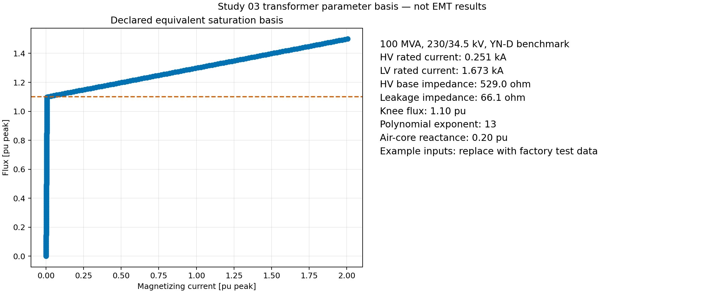
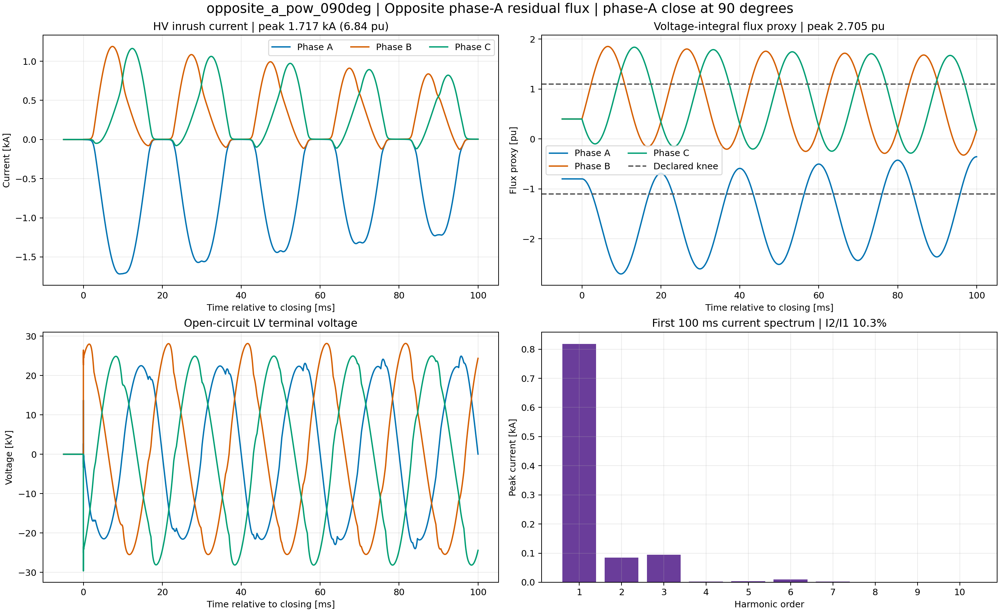
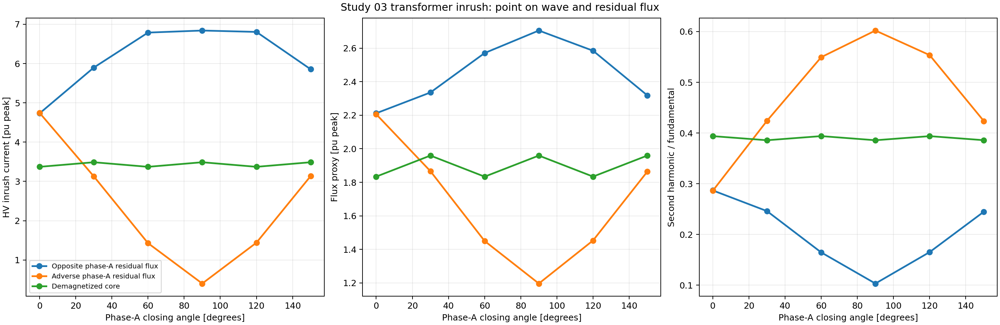
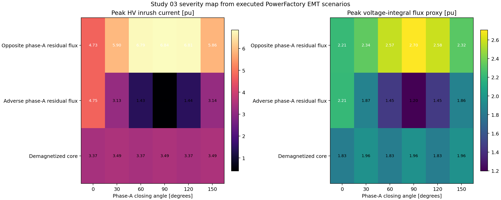
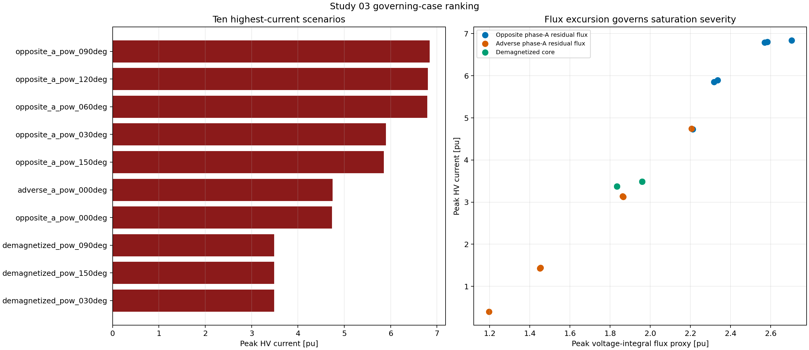

# Study 03 — 230/34.5 kV Transformer Energization and Inrush

> **Status: engine verified.** The 18-case campaign documented here was executed
> with DIgSILENT PowerFactory 2024 SP2 in instantaneous EMT mode. The retained
> tables and figures come from those executions; the parameter-basis figure is
> explicitly an input illustration.

## Industrial purpose

This benchmark answers a protection and equipment-duty question: how do breaker
closing angle and physically balanced residual flux change the energization
current of an unloaded 100 MVA, 230/34.5 kV transformer? The study is suitable
as a reproducible training case and as a starting template for a manufacturer-
specific project. It is not an acceptance study for a particular transformer.

## Network and parameter basis

The PowerFactory API creates a 10,000 MVA Thevenin source, source bus, three-
phase energizing breaker, transformer HV bus, nonlinear two-winding transformer
and open-circuit LV bus. The transformer uses a YN-D vector group, 12.5% leakage
impedance, 300 kW copper loss, 0.6% no-load current and 80 kW no-load loss.
Its EMT magnetizing branch is a three-limb polynomial saturation model with a
1.10 pu knee, 0.20 pu air-core reactance and exponent 13. Hysteresis is disabled
in this baseline so that point on wave, residual flux and polynomial saturation
can be interpreted without an additional loop-width assumption.



The left panel visualizes the declared two-slope envelope used to explain the
linear and air-core regions; PowerFactory executes the smooth polynomial fit.
The right panel lists the electrical bases. The curve is an input illustration,
not a simulated waveform, and must be replaced by factory excitation data for
an equipment-specific study.

The API-generated native diagram is named `EMT Transformer Energization
230-34.5 kV` inside the archived project. Engine mode can create and validate
the linked one-line but cannot access PowerFactory's Graphics Board. Open the
PFD interactively and run `scripts/export_diagram_inside_powerfactory.py` after
arranging labels; the electrical objects and connectivity are already present.

## Scenario methodology

1. Build or update every network object by stable name; repeated builds must not
   duplicate the project, equipment type, elements, study case or diagram.
2. Configure `ComInc` for instantaneous EMT from -20 ms to 300 ms with a fixed
   5 μs integration and output step.
3. Start with the breaker open and the transformer initially unsupplied.
4. Apply one of three balanced residual-flux vectors: `[0, 0, 0]`,
   `[0.8, -0.4, -0.4]` or `[-0.8, 0.4, 0.4]` pu.
5. Close all three poles at phase-A angles 0°, 30°, 60°, 90°, 120° and 150°.
6. Record HV phase currents plus HV and LV phase voltages directly in `ElmRes`.
7. Export each result with `ComRes`, normalize its two-row header, reconstruct a
   transparent voltage-integral flux proxy and calculate KPIs.
8. Rank all 18 cases, retain the compact summary and archive the complete PFD.

The deterministic matrix is in
[`parameters/scenario_manifest.csv`](parameters/scenario_manifest.csv), and all
inputs are in [`configs/base.yaml`](configs/base.yaml).

## Executed EMT results

The governing case is `opposite_a_pow_090deg`: phase A closes at 90 electrical
degrees with residual flux `[-0.8, 0.4, 0.4]` pu. Its peak HV current is
**1.717 kA**, or **6.84 pu** on the 0.251 kA rated HV current. The voltage-
integral flux proxy reaches **2.705 pu**, and the 100 ms rectangular-window
second-harmonic/fundamental ratio is **10.3%**. These values describe this
declared educational equivalent only.



The upper-left panel shows the strongly asymmetric and slowly decaying inrush;
phase A reaches the largest negative excursion because its residual state and
closing instant drive flux in the same adverse direction. The upper-right panel
shows why: the reconstructed phase-A flux remains far beyond the declared
1.10 pu knee. The LV open-circuit voltage contains the expected distortion from
the nonlinear magnetizing branch, while the spectrum documents the exact
finite analysis window rather than implying a stationary harmonic signal.



Residual flux changes both the magnitude and the angle dependence. The opposite
phase-A state governs near 60°–120°, whereas the adverse-A state becomes mild
near 90° because its flux polarity opposes that particular voltage integral.
The desaturated core produces a narrower 3.37–3.49 pu range. The plot also
demonstrates that a single closing angle cannot establish transformer duty.



The heatmaps preserve every executed combination and expose the coupling
between initial magnetic state and breaker timing. The current map follows the
flux-excursion map, which is the expected physical signature of saturation.
This cross-check helped detect and reject an earlier linear-model run before it
could be presented as inrush evidence.



The ranking makes the engineering decision explicit: the five highest-current
cases all use the opposite-A residual state. The scatter plot provides an
independent qualitative check that larger voltage-integral flux excursion
produces larger inrush. The relationship is nonlinear because the polynomial
magnetizing branch changes slope beyond the knee.

The complete compact result table is
[`expected/powerfactory_2024_emt_sweep.csv`](expected/powerfactory_2024_emt_sweep.csv),
and the governing metrics are in
[`expected/powerfactory_2024_worst_case.json`](expected/powerfactory_2024_worst_case.json).

## Reproduction

From the repository root:

```powershell
python -m pfemt validate studies/03_transformer_energization/configs/base.yaml
python -m pfemt build studies/03_transformer_energization/configs/base.yaml
python -m pfemt sweep studies/03_transformer_energization/configs/base.yaml
python -m pfemt analyse studies/03_transformer_energization/configs/base.yaml
python -m pfemt archive studies/03_transformer_energization/configs/base.yaml
```

The same actions are available as small scripts in `scripts/`. Engine mode runs
the electrical study; the diagram PNG export must run inside an interactive
PowerFactory `ComPython` object because it requires the Graphics Board.

## Verification and interpretation limits

- Portable tests validate scenario order, balanced residual flux, rated bases,
  flux integration, KPI extraction, figures and manifest generation.
- The opt-in PowerFactory test builds twice, checks `itrmt=2`, `iHyster=0` and
  `ksat=13`, executes the governing EMT case, parses the CSV and enforces a
  nonlinear current threshold.
- The flux channel shown here is reconstructed from measured HV terminal
  voltage. It is deliberately labelled a proxy; winding resistive drop and the
  exact internal magnetizing voltage are not removed.
- Simultaneous three-pole closing is used. Pole scatter, source-strength,
  operating-voltage and time-step sensitivities remain extensions for a final
  equipment study.
- Replace the illustrative excitation inputs, residual-flux bounds and losses
  with factory test data before relay or insulation decisions.

## References

- DIgSILENT PowerFactory 2024, *Two-Winding Transformer (3-Phase)* technical
  reference, sections 6.2–6.3, installed with PowerFactory.
- [DIgSILENT: transformer saturation conversion for EMT](https://www.digsilent.de/en/faq-reader-powerfactory/how-do-you-convert-the-saturation-characteristic-of-a-transformer-from-rms-values-to-peak-values-for-emt-studies.html)
- [DIgSILENT: exporting results through Python](https://www.digsilent.de/en/faq-reader-powerfactory/how-can-i-export-results-via-python.html)
- [IEC 60076-1: Power transformers — General](https://webstore.iec.ch/en/publication/588)
- [IEC 60076-3: Insulation levels and dielectric tests](https://webstore.iec.ch/en/publication/601)

## Restorable project

- Archive: [`powerfactory/PFEMT_03_Transformer_Inrush_230_34kV.pfd`](powerfactory/PFEMT_03_Transformer_Inrush_230_34kV.pfd)
- Integrity: [`powerfactory/SHA256SUMS`](powerfactory/SHA256SUMS)
- Execution metadata: [`expected/run_metadata_powerfactory_2024.json`](expected/run_metadata_powerfactory_2024.json)
