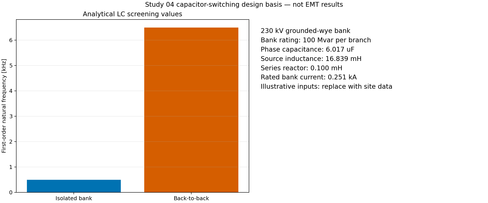
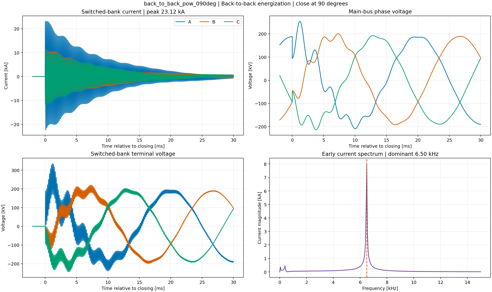
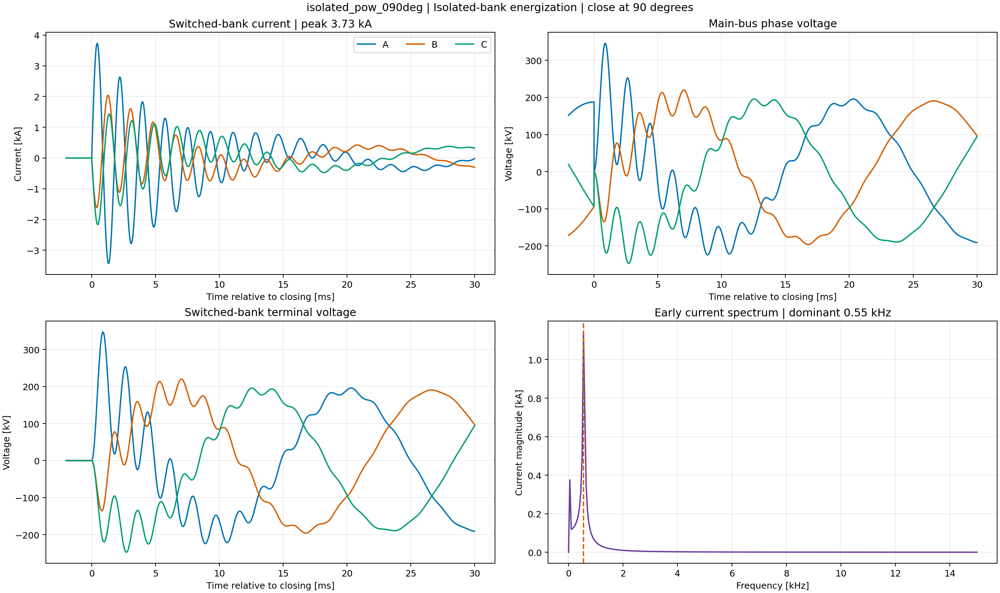
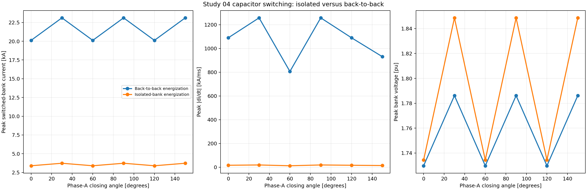

# Study 04 — 230 kV Capacitor-Bank Energization

> **Status: engine verified.** Twelve instantaneous EMT cases were executed in
> DIgSILENT PowerFactory 2024 SP2: isolated-bank and back-to-back energization at
> six phase-A closing angles.

## Industrial purpose

This study quantifies the change in breaker, reactor and bank-terminal duty when
a 100 Mvar grounded-wye bank is connected to an empty bus or beside an already
energized equal bank. It is an educational screening model; actual duty limits
require the site bank design, breaker rating, connection inductance and losses.

## Model and method

The API creates a 230 kV, 10,000 MVA Thevenin source and two parallel bank
branches. Each branch contains a three-phase breaker, 0.10 mH/0.020 ohm reactor
and 100 Mvar `ElmShnt` bank. Bank A is switched; bank B is open for the isolated
cases and pre-energized for the back-to-back cases. The solver uses a 2 μs step
from -5 ms to 100 ms.

1. Calculate phase capacitance from three-phase MVAr and line voltage.
2. Calculate source inductance from short-circuit strength.
3. Screen isolated and back-to-back natural frequencies with reduced LC models.
4. Build/update all PowerFactory objects and the native linked one-line.
5. Apply six closing angles from 0° to 150° to each topology.
6. Export phase current, main-bus voltage and switched-bank voltage.
7. Measure peak current, `di/dt`, voltage, and early ringing frequency.
8. Compare the two topologies and archive the restorable project.



The analytical screen predicts approximately 0.499 kHz for isolated switching
and 6.488 kHz for the local back-to-back exchange. The phase capacitance is
6.017 μF and rated bank current is 0.251 kA. These are input-derived checks, not
PowerFactory results.

## Executed results

The back-to-back 90° case governs current at **23.116 kA**, with a dominant
frequency of **6.499 kHz**, peak `di/dt` of **1258 kA/ms**, and bank-terminal
voltage of **1.786 pu**. The isolated 90° case reaches **3.732 kA**, about
**0.550 kHz**, and **1.849 pu**. The high back-to-back current results from the
very small local connection inductance; it is precisely the quantity that must
be replaced with a surveyed bus/reactor equivalent for a real installation.



The current panel shows the high-frequency discharge/charge exchange between
the pre-energized and newly connected banks. Main-bus voltage is less severe
than the local bank terminal, while the spectrum isolates the 6.5 kHz mode.
This is why a source-only equivalent is insufficient for back-to-back duty.



With bank B disconnected, source inductance governs and the oscillation slows
to roughly 550 Hz. The peak current is much smaller, but the terminal-voltage
overshoot remains important. Current and voltage duties therefore need separate
rankings rather than one universal “worst case.”



The comparison shows two angle families created by three-phase symmetry. All
back-to-back cases dominate current and `di/dt`; isolated cases produce the
slightly larger bank-voltage maximum in this benchmark. Controlled switching
must be evaluated against both objectives.

## Reproduction and evidence

```powershell
python -m pfemt build studies/04_capacitor_bank_energization/configs/base.yaml
python -m pfemt sweep studies/04_capacitor_bank_energization/configs/base.yaml
python -m pfemt analyse studies/04_capacitor_bank_energization/configs/base.yaml
python -m pfemt archive studies/04_capacitor_bank_energization/configs/base.yaml
```

- Scenario matrix: [`parameters/scenario_manifest.csv`](parameters/scenario_manifest.csv)
- Executed summary: [`expected/powerfactory_2024_emt_sweep.csv`](expected/powerfactory_2024_emt_sweep.csv)
- Governing metrics: [`expected/powerfactory_2024_worst_case.json`](expected/powerfactory_2024_worst_case.json)
- Restorable PFD: [`powerfactory/PFEMT_04_Capacitor_Switching_230kV.pfd`](powerfactory/PFEMT_04_Capacitor_Switching_230kV.pfd)
- Archive hash: [`powerfactory/SHA256SUMS`](powerfactory/SHA256SUMS)

The native diagram `EMT Capacitor Switching 230 kV` is stored in the PFD. Final
label routing and PNG export remain an interactive Graphics Board task.

## Limits and references

Trapped charge, pole scatter, restrike, internal capacitor units/fuses and a
breaker arc model are outside this baseline. An ideal-switch result cannot
establish breaker life or restrike probability.

- [DIgSILENT capacitor-switching example](https://www.digsilent.de/en/faq-reader-powerfactory/do-you-have-an-example-on-capacitor-switching.html)
- [DIgSILENT residual-voltage initialization](https://www.digsilent.de/en/faq-reader-powerfactory/i-want-to-model-the-residual-voltage-for-capacitor-switching-can-you-help-me.html)
- [CIGRE Technical Brochure 817](https://electra.cigre.org/313-december-2020/technical-brochures/shunt-capacitor-switching-in-distribution-and-transmission-systems.html)
- [IEC 60871-1](https://webstore.iec.ch/en/publication/3770)
