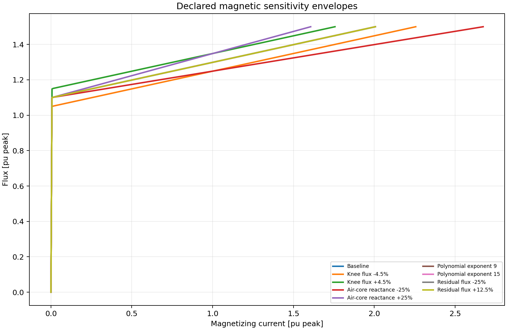
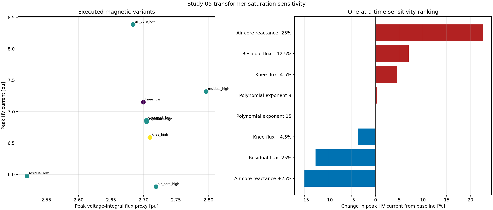
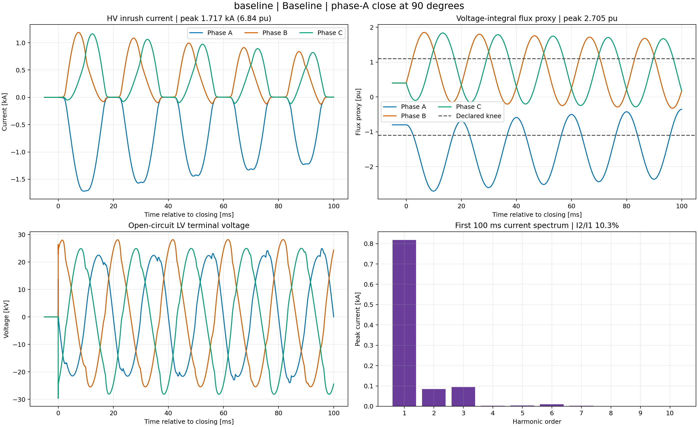
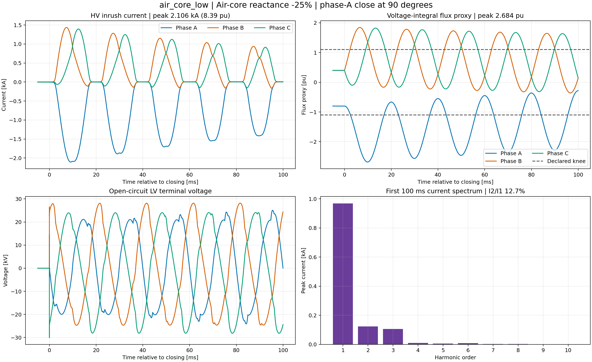

# Study 05 — Transformer Saturation Sensitivity

> **Status: engine verified.** Nine magnetic variants were executed in
> PowerFactory 2024 SP2 at the governing 90°/opposite-residual operating point
> identified by Study 03.

## Industrial purpose and method

Transformer inrush is often more uncertain than the network equivalent because
the excitation curve, residual flux and air-core slope are not available early
in a project. This study quantifies which assumptions deserve manufacturer data
or focused sensitivity work.

1. Rebuild the Study 03 electrical topology in an independent project.
2. Freeze rating, vector group, source, event, solver and result channels.
3. Start every case from the same 90° closing and `[-0.8, 0.4, 0.4]` pu residual.
4. Change one input at a time: knee flux, air-core reactance, polynomial
   exponent or residual magnitude.
5. Execute EMT, calculate identical current/flux/harmonic KPIs and rank change
   relative to the baseline.
6. Restore the baseline `TypTr2` values in a guaranteed cleanup block before
   archiving the project.



The overlay is a design-input visualization of the linear/air-core envelopes,
not a simulation result. It shows why air-core reactance strongly changes
current after the knee, whereas exponent variants share almost the same
asymptotic envelope.

## Executed results

The 6.84 pu baseline rises to **8.39 pu** when air-core reactance is reduced from
0.20 to 0.15 pu and falls to **5.80 pu** when it increases to 0.25 pu. Increasing
residual magnitude 12.5% gives **7.32 pu**; reducing it 25% gives **5.98 pu**.
Moving the knee from 1.10 to 1.05/1.15 pu produces 7.15/6.59 pu. Exponent 9/15
changes peak current by less than one percent in this particular campaign.



The tornado panel identifies the saturated slope and remanence as the dominant
uncertainties. The scatter panel also shows that similar flux excursion can
produce different current when the air-core slope changes; voltage-integral
flux alone is therefore not a substitute for the magnetizing characteristic.



The baseline reproduces Study 03 exactly at 1.717 kA and 6.84 pu, which verifies
that the independent project did not silently change the network or event.



The lower air-core reactance produces 2.106 kA and 8.39 pu. Its waveform retains
the expected asymmetric inrush shape but carries more current for the same flux
region, directly explaining the sensitivity ranking.

## Reproduction and evidence

```powershell
python -m pfemt sweep studies/05_transformer_saturation_sensitivity/configs/base.yaml
python -m pfemt analyse studies/05_transformer_saturation_sensitivity/configs/base.yaml
python -m pfemt archive studies/05_transformer_saturation_sensitivity/configs/base.yaml
```

- Matrix: [`parameters/scenario_manifest.csv`](parameters/scenario_manifest.csv)
- Executed results: [`expected/powerfactory_2024_emt_sweep.csv`](expected/powerfactory_2024_emt_sweep.csv)
- PFD: [`powerfactory/PFEMT_05_Transformer_Sensitivity.pfd`](powerfactory/PFEMT_05_Transformer_Sensitivity.pfd)
- Hash: [`powerfactory/SHA256SUMS`](powerfactory/SHA256SUMS)

These percentage bands are educational assumptions, not statistical confidence
intervals. Factory excitation, core construction and remanence data are needed
before specifying relay restraint or transformer duty.

References: [DIgSILENT saturation conversion](https://www.digsilent.de/en/faq-reader-powerfactory/how-do-you-convert-the-saturation-characteristic-of-a-transformer-from-rms-values-to-peak-values-for-emt-studies.html),
[DIgSILENT parameter identification](https://www.digsilent.de/en/faq-reader-powerfactory/how-do-you-configure-the-system-parameter-identification-for-emt-simulations.html),
and the installed PowerFactory 2024 *Two-Winding Transformer (3-Phase)* technical
reference, sections 6.2–6.3.
