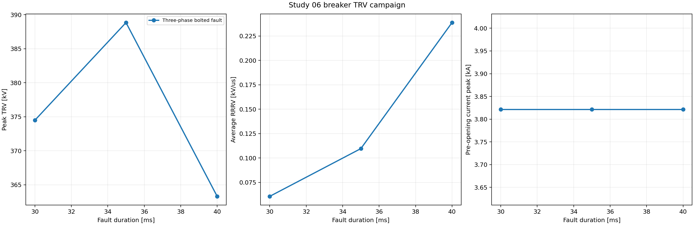
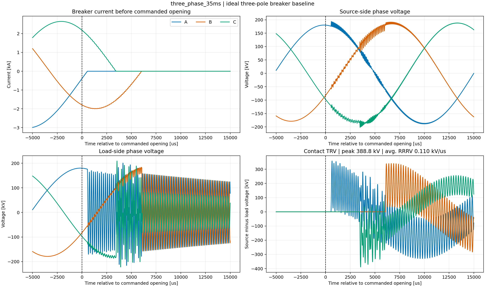
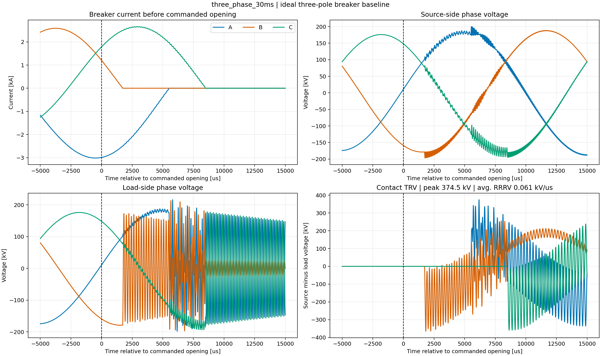

# Study 06 — 230 kV Circuit-Breaker Transient Recovery Voltage

> **Status: engine verified.** Three fault-clearing cases were executed with
> DIgSILENT PowerFactory 2024 SP2 in instantaneous EMT mode. This is an
> educational ideal-breaker benchmark, not a breaker compliance assessment.

## Industrial purpose

Transient recovery voltage (TRV) is the voltage that develops across a breaker
pole after interruption. This example shows the auditable calculation needed
before comparing a duty with a breaker capability: retain both terminal
voltages, form their signed difference per phase, identify the peak and its
time, and report a clearly defined rate of rise. It intentionally does not
invent an IEC envelope because no breaker rating or duty class was supplied.

## Network and parameter basis

The API builds a 230 kV, 10,000 MVA grounded Thevenin source, source bus,
three-pole breaker, load-side bus, series network equivalent, fault bus, and
small source/load shunt capacitances. The 0.15 pu series reactance is on a
100 MVA base; the 0.20/0.10 Mvar shunts are illustrative capacitance scales.
The breaker begins closed, a three-phase 0.01 ohm fault is applied at 20 ms,
and a three-pole opening command is issued after 30, 35, or 40 ms of fault.

The native linked diagram is named `EMT Breaker TRV 230 kV` in the archived
PowerFactory project. Open the PFD interactively to arrange labels and export
the native single-line; engine mode creates and validates the electrical
diagram but does not expose the interactive Graphics Board.

## Methodology

1. Create or update every object by stable API name and build the model twice
   to prove that the builder is idempotent.
2. Configure `ComInc`/`ComSim` for instantaneous EMT from -5 to 85 ms with a
   fixed 5 microsecond integration and output step.
3. Apply the three-phase fault at 20 ms with `EvtShc`.
4. Issue a three-pole breaker-open `EvtSwitch` at 50, 55, or 60 ms.
5. Record breaker phase current and phase voltage at both breaker terminals.
6. Calculate each contact voltage as `V_source − V_load`, preserving polarity.
7. Search the first 20 ms after the opening command for peak absolute TRV.
8. Report time to peak and average RRRV as peak divided by that elapsed time;
   this is not an adjacent-sample derivative or a standard reference-line test.
9. Rank cases, retain compact results, and export a restorable PFD archive.

The complete matrix is in
[`parameters/scenario_manifest.csv`](parameters/scenario_manifest.csv), while
[`configs/base.yaml`](configs/base.yaml) is the executable data contract.

## Executed EMT results

The largest contact stress occurs for `three_phase_35ms`: **388.84 kV peak**
(**2.071 pu** on nominal phase peak), **3,548 microseconds** from the commanded
opening, and **0.110 kV/microsecond** average RRRV. The largest reported average
RRRV is **0.239 kV/microsecond** in the 40 ms fault-duration case because its
limiting phase reaches a smaller peak sooner. These are distinct duties and
must not be collapsed into one “worst” number.



The three panels separate voltage peak, average rate of rise, and pre-opening
current. Fault current is almost unchanged because network impedance is fixed;
the opening instant instead changes each pole's instantaneous voltage/current
condition, which shifts both TRV peak and time to peak.



The upper panels show current before interruption and the source-side voltage.
The lower panels show the isolated load-side response and the calculated
contact voltage. The traces verify the defining identity: contact TRV is the
instantaneous difference between the two voltages, not a bus-voltage channel
renamed as TRV.



Changing the opening command by 5 ms moves the breaker to a different point on
the power-frequency wave. The resulting phase that limits the duty, peak time,
and average RRRV all change even though the fault-current peak is the same.
This is why an interruption study must retain pole-resolved waveforms.

The full compact table is
[`expected/powerfactory_2024_emt_sweep.csv`](expected/powerfactory_2024_emt_sweep.csv)
and the peak-TRV case is
[`expected/powerfactory_2024_worst_case.json`](expected/powerfactory_2024_worst_case.json).

## Reproduction

```powershell
python -m pfemt validate studies/06_circuit_breaker_trv/configs/base.yaml
python -m pfemt build studies/06_circuit_breaker_trv/configs/base.yaml
python -m pfemt sweep studies/06_circuit_breaker_trv/configs/base.yaml
python -m pfemt analyse studies/06_circuit_breaker_trv/configs/base.yaml
python -m pfemt archive studies/06_circuit_breaker_trv/configs/base.yaml
```

## Verification and limits

- Unit tests cover scenario generation, duplicate-time handling, TRV identity,
  peak/time/RRRV extraction, manifests, and all plot functions.
- Engine verification builds twice and all displayed values come from exported
  `ElmRes` channels; no synthetic waveform is retained as execution evidence.
- This ideal breaker is suitable for learning the terminal-voltage method. It
  cannot assess arc voltage, post-arc current, current chopping, dielectric
  recovery, reignition, or contact wear.
- A project study must add the exact terminal/short-line fault duty, breaker
  rating, standard edition, manufacturer envelope, capacitances, line model,
  pole scatter, and time-step sensitivity before any pass/fail conclusion.

## References

- [DIgSILENT: high-voltage breaker TRV analysis example](https://www.digsilent.de/index.php/en/faq-reader-powerfactory/do-you-have-an-example-for-high-voltage-circuit-breakers-for-transient-recovery-voltage-trv-analysis.html)
- [DIgSILENT: breaker opening options in RMS and EMT](https://www.digsilent.de/en/faq-reader-powerfactory/what-are-the-options-available-for-breaker-switch-open-actions-in-rms-and-emt-simulation.html)
- [DIgSILENT: general EMT simulation guidance](https://www.digsilent.de/en/faq-reader-powerfactory/can-you-provide-any-general-guidance-on-how-to-perform-an-emt-simulation.html)
- [IEC 62271-100:2021+AMD1:2024](https://webstore.iec.ch/en/publication/62785)

## Restorable project

- Archive: [`powerfactory/PFEMT_06_Breaker_TRV_230kV.pfd`](powerfactory/PFEMT_06_Breaker_TRV_230kV.pfd)
- Integrity: [`powerfactory/SHA256SUMS`](powerfactory/SHA256SUMS)
- Execution metadata: [`expected/run_metadata_powerfactory_2024.json`](expected/run_metadata_powerfactory_2024.json)
