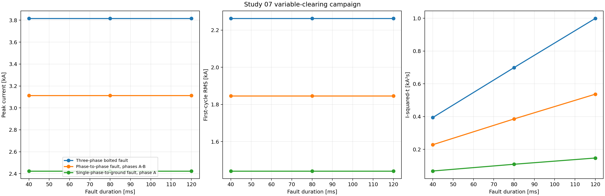
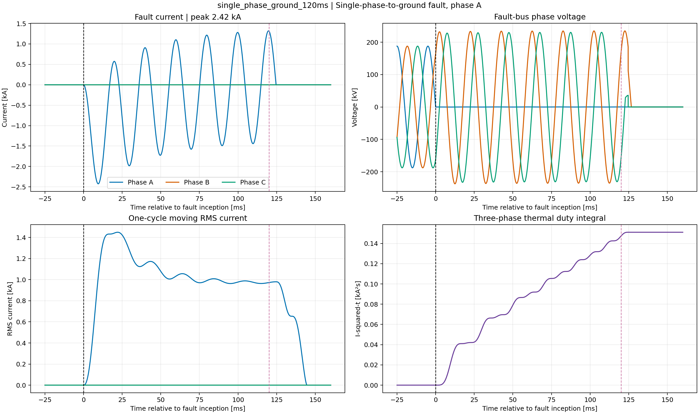
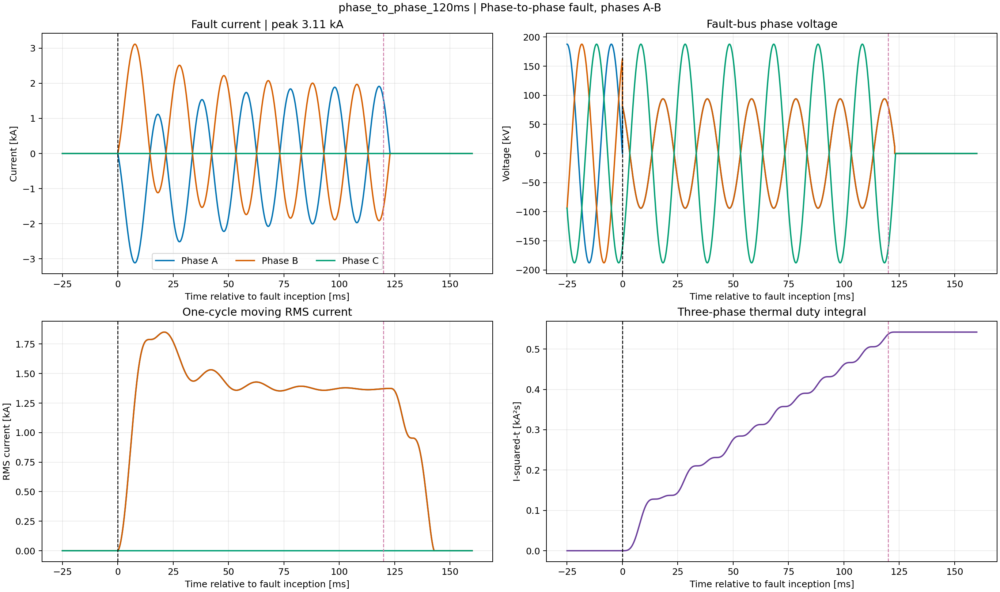
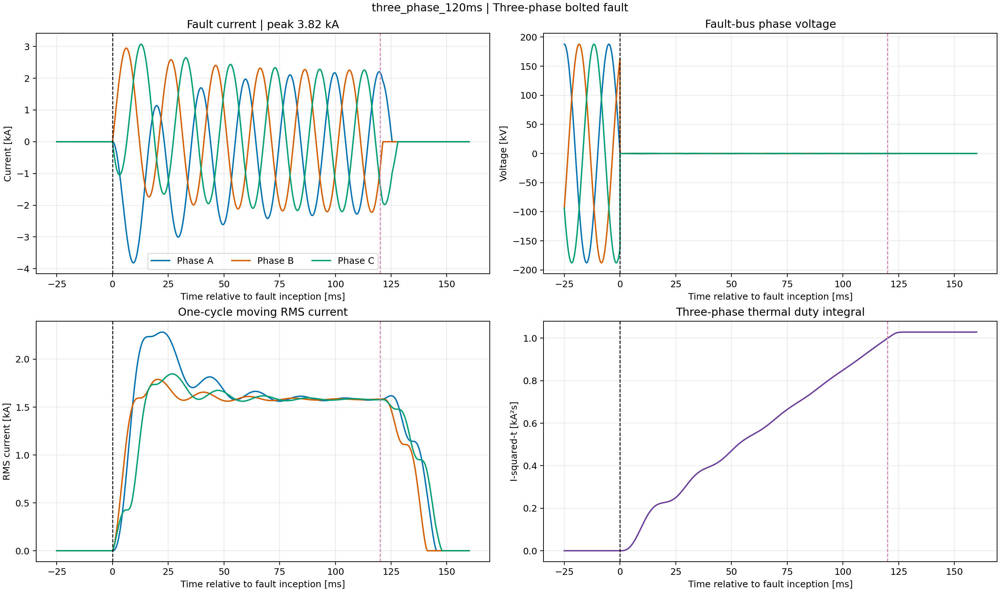

# Study 07 — 230 kV Faults with Variable Breaker Clearing

> **Status: engine verified.** Nine single-phase-to-ground, phase-to-phase, and
> three-phase fault cases were executed with DIgSILENT PowerFactory 2024 SP2 in
> instantaneous EMT mode.

## Industrial purpose

This campaign demonstrates how fault type and protection clearing time change
instantaneous current, first-cycle RMS current, thermal duty, bus depression,
and recovery. It uses a deliberately compact network so that phase selection,
event ordering, and the expected linear growth of I-squared-t can be inspected
before the workflow is transferred to a detailed utility model.

## Network and parameter basis

The generated model consists of a grounded 10,000 MVA Thevenin source at
230 kV, feeder breaker, 100 MVA series network equivalent, and remote fault
bus. Positive-sequence impedance is `0.01 + j0.15 pu`; zero-sequence impedance
is `0.03 + j0.45 pu`. The fault resistance is 0.10 ohm. These are declared
teaching inputs rather than site data.

The linked PowerFactory diagram is named `EMT Fault Clearing 230 kV`. Its
electrical symbols are generated by the API and stored in the PFD. Diagram
routing and result-box layout can be refined interactively without changing
the automation or the evidence retained here.

## Methodology

1. Build the source-breaker-impedance-fault network twice and compare stable
   object paths to prevent duplicated equipment or study cases.
2. Configure instantaneous EMT from -5 to 180 ms with a 10 microsecond fixed
   integration/output step.
3. Apply a phase-A-to-ground, A-B, or three-phase fault at 20 ms using `EvtShc`.
4. Issue a three-pole breaker-open command after 40, 80, or 120 ms of fault.
5. Record instantaneous breaker current, remote fault-bus voltage, and healthy
   source-bus voltage for all three phases.
6. Verify the physical phase signature: one current for SLG, two for L-L, and
   three for the three-phase fault.
7. Calculate absolute peak, maximum phase first-cycle RMS, three-phase
   I-squared-t, minimum fault-bus voltage, and source-bus recovery peak.
8. Confirm current extinction after the poles reach current zero; a simultaneous
   trip command does not imply identical interruption instants in EMT.
9. Rank thermal duty, freeze compact evidence, and archive the complete PFD.

The nine deterministic cases are listed in
[`parameters/scenario_manifest.csv`](parameters/scenario_manifest.csv).

## Executed EMT results

The three-phase 120 ms case governs retained thermal duty: **3.816 kA peak**,
**2.263 kA maximum first-cycle RMS**, and **0.999 kA²s** three-phase
I-squared-t. At 40, 80, and 120 ms, the corresponding three-phase integrals are
0.395, 0.699, and 0.999 kA²s. The near-linear increase is the expected physical
check for a sustained current of similar magnitude.



Peak and first-cycle RMS current depend mainly on fault type and remain nearly
constant across duration. I-squared-t increases with clearing time. The
three-phase fault governs this benchmark, while the zero-sequence impedance
limits the phase-A-to-ground current.



Only phase A carries fault current; phases B and C remain essentially zero at
the breaker. The faulted phase voltage collapses, while healthy phase voltages
reflect the grounded sequence network. This phase signature independently
confirms that PowerFactory interpreted fault code 2 as the intended SLG event.



The A-B event produces equal-magnitude opposite-path current in two phases and
negligible phase-C current. No ground-current path is required. The moving RMS
panel separates sustained duty from instantaneous asymmetry, and the integral
panel makes the effect of delayed clearing visible.



All three phases contribute during the balanced fault. Following the common
trip command, individual poles interrupt at their current zeros, so the final
phase can persist for several milliseconds before all currents reach zero.
The source bus recovers to approximately 1.0 pu while the isolated fault bus
remains faulted downstream of the open breaker.

The compact campaign table is
[`expected/powerfactory_2024_emt_sweep.csv`](expected/powerfactory_2024_emt_sweep.csv)
and the maximum-I-squared-t case is
[`expected/powerfactory_2024_worst_case.json`](expected/powerfactory_2024_worst_case.json).

## Reproduction

```powershell
python -m pfemt validate studies/07_faults_variable_clearing/configs/base.yaml
python -m pfemt build studies/07_faults_variable_clearing/configs/base.yaml
python -m pfemt sweep studies/07_faults_variable_clearing/configs/base.yaml
python -m pfemt analyse studies/07_faults_variable_clearing/configs/base.yaml
python -m pfemt archive studies/07_faults_variable_clearing/configs/base.yaml
```

## Verification and limits

- Portable tests cover the 3-by-3 matrix, metrics, manifests, plots, and
  repeated PowerFactory event timestamps.
- Engine-backed phase-current checks confirmed the intended SLG, L-L, and 3F
  mappings, breaker current extinction, and approximately 1 pu source recovery.
- `I²t` is the direct three-phase waveform integral in kA²s, not the IEC 60909
  thermal-equivalent formula. IEC 60909 should be added as an independent
  initial-current benchmark when a project-specific network is available.
- The constant-resistance fault is not an arc model. CT saturation, relay
  filtering/logic, breaker arc detail, LLG faults, location/inception sweeps,
  backup protection, and reclosing are documented extensions.

## References

- [DIgSILENT: EMT single-phase-to-ground fault example](https://www.digsilent.de/en/faq-reader-powerfactory/do-you-have-an-example-of-modelling-a-single-phase-line-to-ground-fault.html)
- [DIgSILENT: breaker opening options in RMS and EMT](https://www.digsilent.de/en/faq-reader-powerfactory/what-are-the-options-available-for-breaker-switch-open-actions-in-rms-and-emt-simulation.html)
- [DIgSILENT: external-grid short-circuit representation](https://www.digsilent.de/en/faq-reader-powerfactory/how-to-set-up-a-model-of-hv-grid-as-an-external-grid-for-short-circuit-calculation.html)
- [IEC 60909-0:2026](https://webstore.iec.ch/en/publication/68454)

## Restorable project

- Archive: [`powerfactory/PFEMT_07_Fault_Clearing_230kV.pfd`](powerfactory/PFEMT_07_Fault_Clearing_230kV.pfd)
- Integrity: [`powerfactory/SHA256SUMS`](powerfactory/SHA256SUMS)
- Execution metadata: [`expected/run_metadata_powerfactory_2024.json`](expected/run_metadata_powerfactory_2024.json)
