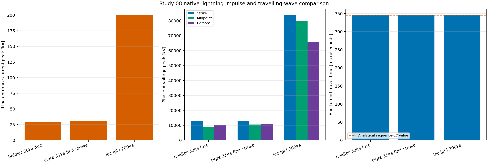
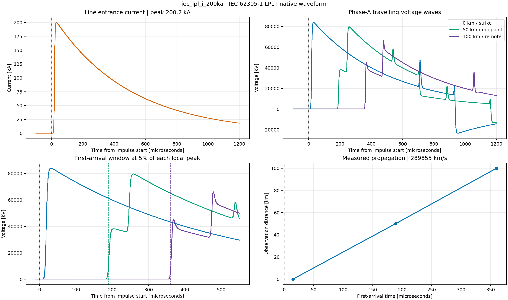
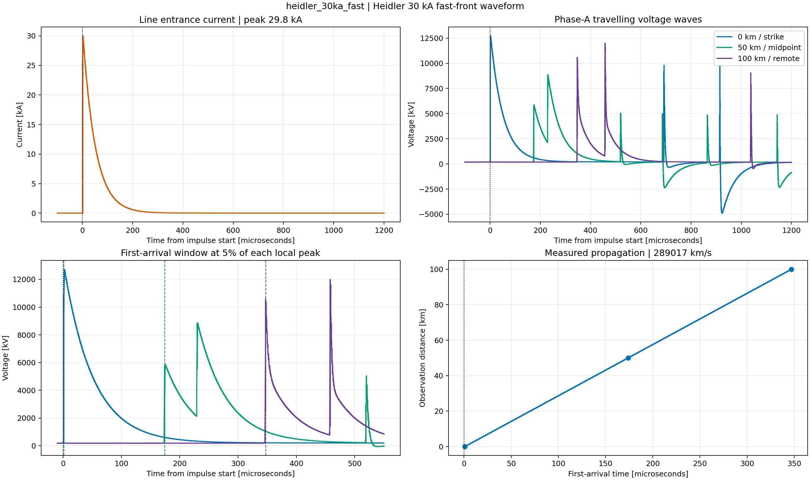
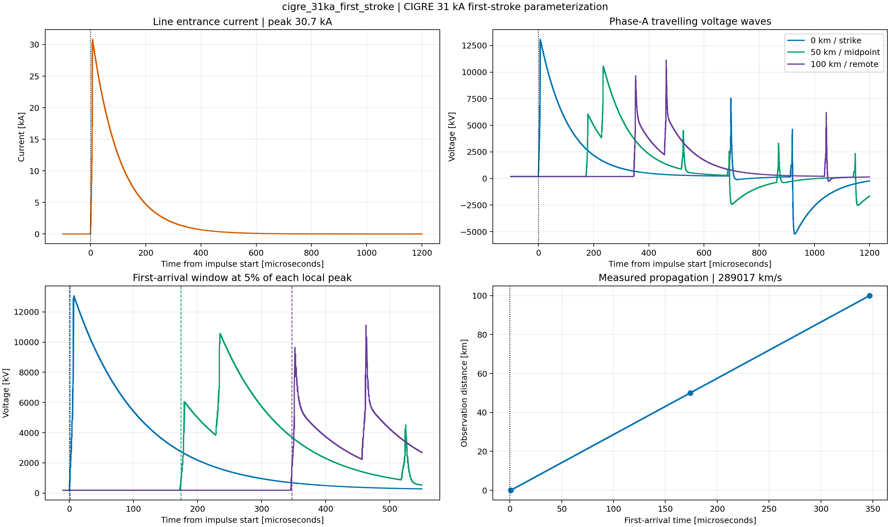
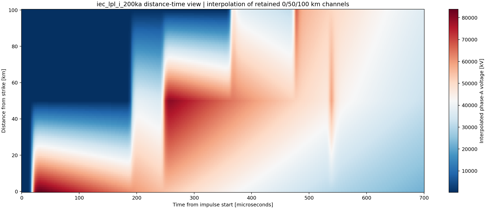

# Study 08 — 230 kV Lightning Impulse and Travelling Waves

> **Status: engine verified.** Three native `ElmImpulse` waveforms were
> executed with DIgSILENT PowerFactory 2024 SP2 in instantaneous, unbalanced
> EMT mode on two distributed 50 km line sections.

## Industrial purpose

Lightning studies must prove both the injected current waveform and the wave
propagation before insulation conclusions are attempted. This benchmark shows
that foundation: IEC 62305-1, Heidler, and CIGRE native impulse sources are
applied to phase A; voltage is observed at 0, 50, and 100 km; arrival time is
compared with a sequence-LC analytical estimate; and every waveform is retained
with explicit source parameters.

The case is intentionally a line-propagation benchmark. It does not include a
tower, shield wire, footing ionisation, insulator flashover, transformer, or
metal-oxide arrester. The calculated voltage therefore represents the severe
unclamped network response, not an equipment withstand conclusion.

## Network and parameter basis

The PowerFactory API creates a single-phase `ElmImpulse` at the strike bus, two
50 km frequency-dependent distributed `ElmLne` sections, midpoint and remote
observation buses, and a 285.7 ohm incremental termination connected to an
energized 230 kV reference. The line uses the same declared sequence data as
the Study 01 overhead-line teaching model but is fitted from 10 Hz to 2 MHz
with a 200 kHz main transient frequency.

From the declared positive-sequence L and C, the first-order surge impedance is
**285.62 ohm**, propagation velocity is **289,452 km/s**, each 50 km transit is
**172.74 microseconds**, and the 100 km transit is **345.48 microseconds**.

The linked native diagram is named `EMT Lightning Waves 230 kV` in the PFD. It
contains the real electrical objects and connections. Interactive diagram
routing, tower geometry overlays, and result boxes can be added later without
changing the automated study contract.

## Methodology

1. Create or update the impulse, four buses, two distributed line sections,
   termination, reference, study case, and linked diagram by stable names.
2. Fit both line sections in the 10 Hz–2 MHz band and reject the build if
   `AreDistParamsPossible()` or `FitParams()` reports an error.
3. Configure the study load flow and `ComInc` for unbalanced ABC operation;
   `ElmImpulse` is a single-phase element and balanced initialization is invalid.
4. Run from -100 to 1,200 microseconds with a fixed 0.1 microsecond integration
   and output step.
5. Set only the parameters writable for the selected native waveform family.
6. Trigger the unconnected scalar `trigger` input at time zero with `EvtParam`.
7. Record phase-A entrance current and voltage at 0, 50, and 100 km.
8. Identify each first arrival at 5% of its local peak, then compare the
   end-to-end transit with the independent L-C value.
9. Integrate entrance current for source charge, retain peak/half-value time,
   rank remote voltage, generate figures, and archive the PFD.

The exact source matrix is in
[`parameters/scenario_manifest.csv`](parameters/scenario_manifest.csv) and all
network inputs are in [`configs/base.yaml`](configs/base.yaml).

## Executed EMT results

| Waveform | Entrance current | Remote peak | 100 km transit | Arrival error |
|---|---:|---:|---:|---:|
| IEC 62305-1 LPL I | 200.24 kA | 65,965.72 kV | 345.0 µs | -0.14% |
| Heidler fast front | 29.81 kA | 10,240.46 kV | 346.0 µs | +0.15% |
| CIGRE first stroke | 30.67 kA | 10,943.26 kV | 346.0 µs | +0.15% |

The IEC case governs voltage and charge in this deliberately unclamped line:
**83,933 kV** at the strike bus, **79,678 kV** at 50 km, **65,966 kV** at
100 km, and **91.45 C** over the retained 1.2 ms window. These values are
evidence of why a complete insulation-coordination model needs towers,
flashover paths, arresters, lead inductance, and equipment capacitance.



The first panel verifies that the line-entrance current follows the configured
source scale. The voltage panel separates stress at the strike, midpoint, and
remote terminal. The travel-time panel shows that all waveform families give
the same propagation delay; source shape changes stress, not line velocity.



The broad 200 kA IEC waveform produces the largest response. Its local 5%
threshold is crossed later than for the fast-front cases, but differences
between successive observation times remain one section transit. The lower
right plot converts those arrivals into an apparent velocity of about
289,855 km/s.



The Heidler case reaches nearly 30 kA with a much faster front and a 38
microsecond measured half-value time in the retained line current. The voltage
front remains sharp after 100 km, demonstrating why a 0.1 microsecond step and
MHz-range line fit are used rather than a power-frequency line equivalent.



The CIGRE parameterization uses the native maximum-steepness input instead of a
Heidler correction factor. Its 31 kA scale produces a slightly greater remote
peak and charge than the 30 kA Heidler case. This comparison also verifies that
waveform-specific API attributes are not applied indiscriminately.



The diagonal color front visualizes propagation from the strike toward the
remote bus. The map is explicitly an interpolation of the three retained
0/50/100 km channels; it is an educational view, not a claim that 101 physical
measurement points were simulated.

The compact executed results are in
[`expected/powerfactory_2024_emt_sweep.csv`](expected/powerfactory_2024_emt_sweep.csv)
and the maximum-remote-voltage case is
[`expected/powerfactory_2024_worst_case.json`](expected/powerfactory_2024_worst_case.json).

## Reproduction

```powershell
python -m pfemt validate studies/08_lightning_travelling_waves/configs/base.yaml
python -m pfemt build studies/08_lightning_travelling_waves/configs/base.yaml
python -m pfemt sweep studies/08_lightning_travelling_waves/configs/base.yaml
python -m pfemt analyse studies/08_lightning_travelling_waves/configs/base.yaml
python -m pfemt archive studies/08_lightning_travelling_waves/configs/base.yaml
```

## Verification and limits

- Unit tests verify source matrix order, analytical surge impedance/travel
  time, arrival detection, apparent velocity, charge, and all figures.
- The opt-in engine test builds twice, verifies unbalanced initialization,
  executes the Heidler case, enforces a nonzero impulse current and remote
  stress, and requires measured travel time within 2% of the L-C estimate.
- The sequence-parameter line is portable but not a substitute for actual
  conductor/tower geometry, shield wires, earth return, transposition, or a
  reviewed broadband fit over the project study band.
- A direct phase strike, shield-wire/tower strike, and terminal injection are
  different physical duties. Only direct phase-A terminal injection is modeled.
- Add tower spans, grounding/soil ionisation, a volt-time or leader-progression
  flashover model, arrester V-I/lead model, equipment terminal models, stroke
  statistics, and IEC insulation levels before assessing margin or outage rate.

## References

- DIgSILENT PowerFactory 2024, *Impulse Source (ElmImpulse)* technical
  reference, revision 1, installed with PowerFactory.
- [DIgSILENT: lightning current source in EMT](https://www.digsilent.de/index.php/en/faq-reader-powerfactory/how-can-i-model-a-lightning-current-source-in-powerfactory-emt-simulation.html)
- [DIgSILENT: overhead-line and cable models for EMT](https://faq.digsilent.de/en/faq-reader-powerfactory/how-to-configure-overhead-line-and-cable-models-for-emt-simulations.html)
- [DIgSILENT: insulator flashover during lightning transients](https://www.digsilent.de/en/faq-reader-powerfactory/how-do-you-model-the-flashover-across-transmission-line-insulators-during-lightning-transients/category/dynamic-simulation.html)
- [CIGRE Technical Brochure 839](https://electra.cigre.org/317-august-2021/technical-brochures/procedures-for-estimating-the-lightning-performance-of-transmission-lines-new-aspects-and-guide-to-procedures-for-estimating-the-lightning-performance-of-transmission-lines.html)
- [IEC 62305-1:2024](https://webstore.iec.ch/en/publication/27136)
- [IEC 60071-1](https://webstore.iec.ch/en/publication/59657)
- [IEC 60071-2](https://webstore.iec.ch/en/publication/64145)
- [IEC 60099-4](https://webstore.iec.ch/en/publication/735)

## Restorable project

- Archive: [`powerfactory/PFEMT_08_Lightning_Waves_230kV.pfd`](powerfactory/PFEMT_08_Lightning_Waves_230kV.pfd)
- Integrity: [`powerfactory/SHA256SUMS`](powerfactory/SHA256SUMS)
- Execution metadata: [`expected/run_metadata_powerfactory_2024.json`](expected/run_metadata_powerfactory_2024.json)
